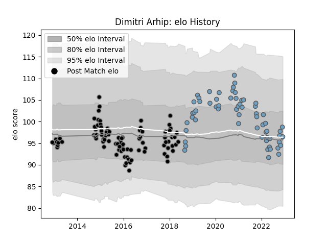

---  
layout: page  
title: Dimitri Arhip  
date: 2022-12-14 11:11:53.306969  
categories: player  
---
# Dimitri Arhip

## Positions: P

## Current elo: 99.0

## Current Percentile: 52.0

# Elo History

# Match History

| Team          |   Appearances |   Win Rate |
|:--------------|--------------:|-----------:|
| Ospreys       |            93 |   0.532258 |
| Cardiff Blues |            63 |   0.47619  |

| Opponent           |   Matches |   Win Rate |
|:-------------------|----------:|-----------:|
| Edinburgh          |        13 |   0.384615 |
| Scarlets           |        13 |   0.538462 |
| Connacht           |        13 |   0.461538 |
| Dragons            |        13 |   0.923077 |
| Munster            |        12 |   0.458333 |
| Ulster             |        10 |   0.2      |
| Benetton Treviso   |         9 |   0.666667 |
| Cardiff Blues      |         9 |   1        |
| Leinster           |         9 |   0.277778 |
| Glasgow Warriors   |         8 |   0.3125   |
| Zebre              |         7 |   0.857143 |
| Ospreys            |         6 |   0.166667 |
| Northampton Saints |         4 |   0.5      |
| Clermont Auvergne  |         3 |   0        |
| Stormers           |         2 |   0.5      |
| Southern Kings     |         2 |   1        |
| Sharks             |         2 |   1        |
| Bulls              |         2 |   0        |
| Saracens           |         2 |   0.25     |
| Racing 92          |         2 |   0.25     |
| Exeter Chiefs      |         2 |   0.5      |
| Lions              |         2 |   0        |
| Bordeaux Begles    |         2 |   0.5      |
| Harlequins         |         2 |   0        |
| Calvisano          |         1 |   1        |
| Lyon               |         1 |   1        |
| Cheetahs           |         1 |   1        |
| Stade Toulousain   |         1 |   0        |
| Grenoble           |         1 |   1        |
| Brive              |         1 |   1        |
| Leicester Tigers   |         1 |   0        |