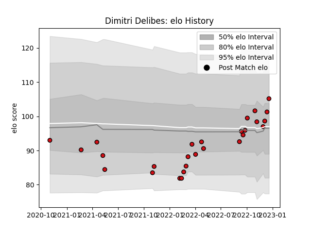

---  
layout: page  
title: Dimitri Delibes  
date: 2023-02-02 18:52:40.946048  
categories: player  
---
# Dimitri Delibes

## Positions: W, C

## Current elo: 111.0

## Current Percentile: 76.0

# Elo History

# Match History

| Team             |   Appearances |   Win Rate |
|:-----------------|--------------:|-----------:|
| Stade Toulousain |            33 |        0.5 |

| Opponent             |   Matches |   Win Rate |
|:---------------------|----------:|-----------:|
| Stade Francais Paris |         4 |   0.125    |
| Castres Olympique    |         3 |   0.333333 |
| Montpellier Herault  |         3 |   1        |
| Perpignan            |         3 |   0.666667 |
| Toulon               |         3 |   0.333333 |
| Bayonne              |         2 |   0        |
| Bordeaux Begles      |         2 |   1        |
| La Rochelle          |         2 |   0.5      |
| Lyon                 |         2 |   0        |
| Munster              |         2 |   1        |
| Pau                  |         2 |   0        |
| Racing 92            |         2 |   0.5      |
| Sale Sharks          |         2 |   1        |
| Clermont Auvergne    |         1 |   1        |