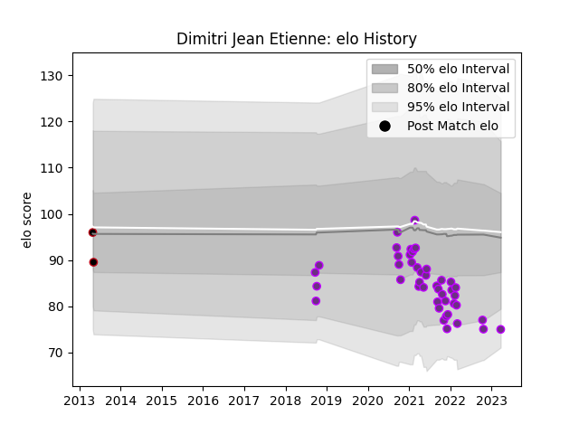

---  
layout: page  
title: Dimitri Jean Etienne  
date: 2023-03-27 11:34:07.002930  
categories: player  
---
# Dimitri Jean Etienne

Last updated: 2023-03-27
## Positions: FL

## Current elo: 75.0

## Current Percentile: 6.0

# Elo History

# Match History

| Team        |   Appearances |   Win Rate |
|:------------|--------------:|-----------:|
| US Bressane |            44 |   0.602273 |
| Lyon        |             2 |   0        |

| Opponent            |   Matches |   Win Rate |
|:--------------------|----------:|-----------:|
| Narbonne            |         4 |   0.5      |
| Carcassonne         |         4 |   0        |
| Albi                |         3 |   0.666667 |
| Agen                |         2 |   1        |
| Colomiers           |         2 |   0.5      |
| Tarbes              |         2 |   0.5      |
| Suresnes            |         2 |   1        |
| Rouen               |         2 |   0.75     |
| Provence Rugby      |         2 |   0.25     |
| Oyonnax             |         2 |   0        |
| Massy               |         2 |   1        |
| Dijon               |         2 |   1        |
| Chambery            |         2 |   1        |
| Bourgoin-Jallieu    |         2 |   0.75     |
| Blagnac             |         2 |   1        |
| Dax                 |         1 |   1        |
| Carqueiranne-Hyères |         1 |   1        |
| Mont-de-Marsan      |         1 |   0        |
| Nevers              |         1 |   0        |
| Nice                |         1 |   0        |
| Pau                 |         1 |   0        |
| Beziers             |         1 |   1        |
| Bayonne             |         1 |   0        |
| Aurillac            |         1 |   1        |
| Aubenas             |         1 |   1        |
| Vannes              |         1 |   0        |