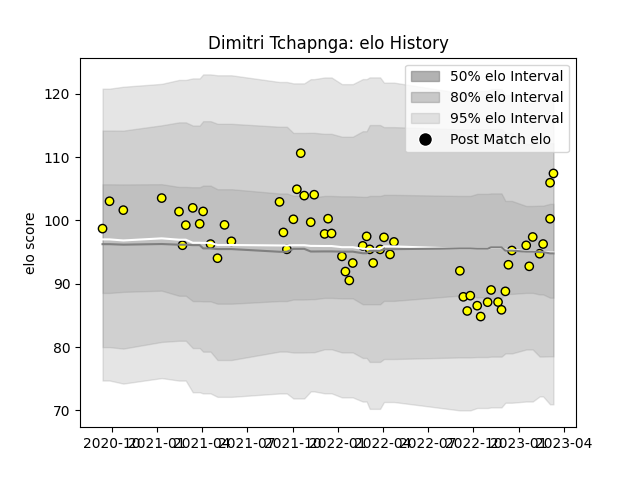

---  
layout: page  
title: Dimitri Tchapnga  
date: 2023-02-02 19:11:09.006442  
categories: player  
---
# Dimitri Tchapnga

## Positions: P

## Current elo: 104.0

## Current Percentile: 59.0

# Elo History

# Match History

| Team   |   Appearances |   Win Rate |
|:-------|--------------:|-----------:|
| Albi   |            53 |   0.698113 |

| Opponent                   |   Matches |   Win Rate |
|:---------------------------|----------:|-----------:|
| Cognac Saint Jean d'Angély |         5 |   0.8      |
| Blagnac                    |         5 |   0.6      |
| Bourgoin-Jallieu           |         4 |   1        |
| Dax                        |         4 |   0.75     |
| Nice                       |         4 |   0.25     |
| Aubenas                    |         3 |   1        |
| Narbonne                   |         3 |   1        |
| Tarbes                     |         3 |   0.333333 |
| Suresnes                   |         3 |   0.666667 |
| Valence Romans Drome Rugby |         3 |   0.666667 |
| Dijon                      |         3 |   1        |
| Chambery                   |         3 |   1        |
| Rennes                     |         2 |   1        |
| Soyaux-Angouleme           |         2 |   0        |
| Carqueiranne-Hyères        |         2 |   0.5      |
| US Bressane                |         2 |   0.5      |
| Massy                      |         2 |   0.5      |