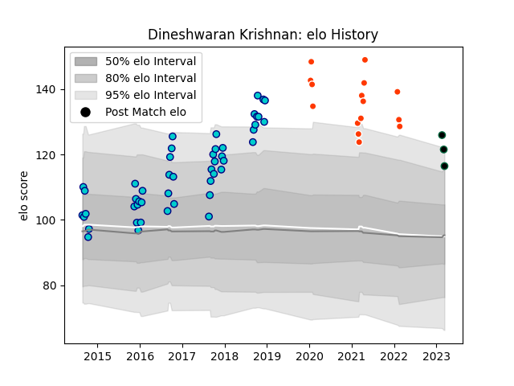

---  
layout: page  
title: Dineshwaran Krishnan  
date: 2023-03-09 10:09:20.731449  
categories: player  
---
# Dineshwaran Krishnan

## Positions: L

## Current elo: 122.0

## Current Percentile: 96.0

# Elo History

# Match History

| Team               |   Appearances |   Win Rate |
|:-------------------|--------------:|-----------:|
| Shizuoka Blue Revs |            48 |    0.78125 |
| Hino Red Dolphins  |            15 |    0.2     |
| Chicago Hounds     |             2 |    0       |

| Opponent                          |   Matches |   Win Rate |
|:----------------------------------|----------:|-----------:|
| Urayasu D-Rocks                   |         6 |   0.666667 |
| Saitama Wild Knights              |         5 |   0.2      |
| Green Rockets Tokatsu             |         5 |   1        |
| Toyota Verblitz                   |         5 |   0.6      |
| Toshiba Brave Lupus Tokyo         |         5 |   0.6      |
| Black Rams Tokyo                  |         4 |   0.75     |
| Yokohama Canon Eagles             |         4 |   1        |
| Kubota Spears Funabashi Tokyo-Bay |         4 |   0.875    |
| Kobelco Kobe Steelers             |         4 |   0.25     |
| Munakata Sanix Blues              |         3 |   1        |
| Coca-Cola Red Sparks              |         3 |   1        |
| Mie Honda Heat                    |         3 |   0.666667 |
| Toyota Industries Shuttles Aichi  |         3 |   1        |
| NTT Docomo Red Hurricanes Osaka   |         2 |   0.5      |
| Shizuoka Blue Revs                |         2 |   0        |
| Tokyo Sungoliath                  |         2 |   0        |
| Mitsubishi Dynaboars              |         1 |   0        |
| Shimizu Blue Sharks               |         1 |   1        |
| Hanazono Kintetsu Liners          |         1 |   0        |
| Utah Warriors                     |         1 |   0        |
| Old Glory DC                      |         1 |   0        |