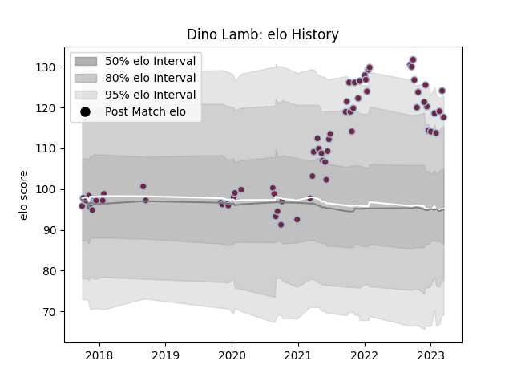

---  
layout: page  
title: Dino Lamb  
date: 2022-12-18 16:24:38.071611  
categories: player  
---
# Dino Lamb

## Positions: L

## Current elo: 99.0

## Current Percentile: 73.0

# Elo History

# Match History

| Team       |   Appearances |   Win Rate |
|:-----------|--------------:|-----------:|
| Harlequins |            64 |     0.5625 |

| Opponent           |   Matches |   Win Rate |
|:-------------------|----------:|-----------:|
| Bath Rugby         |         8 |   0.5      |
| Sale Sharks        |         6 |   0.666667 |
| Worcester Warriors |         6 |   0.666667 |
| Northampton Saints |         5 |   0.6      |
| Saracens           |         5 |   0.4      |
| Wasps              |         4 |   0.5      |
| Ulster             |         4 |   0        |
| Bristol Rugby      |         4 |   0.5      |
| London Irish       |         3 |   0.666667 |
| Newcastle Falcons  |         3 |   1        |
| Leicester Tigers   |         3 |   0.333333 |
| Gloucester Rugby   |         3 |   1        |
| Exeter Chiefs      |         3 |   0.666667 |
| Clermont Auvergne  |         1 |   0        |
| Racing 92          |         1 |   1        |
| Cardiff Blues      |         1 |   1        |
| La Rochelle        |         1 |   0        |
| Scarlets           |         1 |   1        |
| Sharks             |         1 |   0        |
| Castres Olympique  |         1 |   1        |