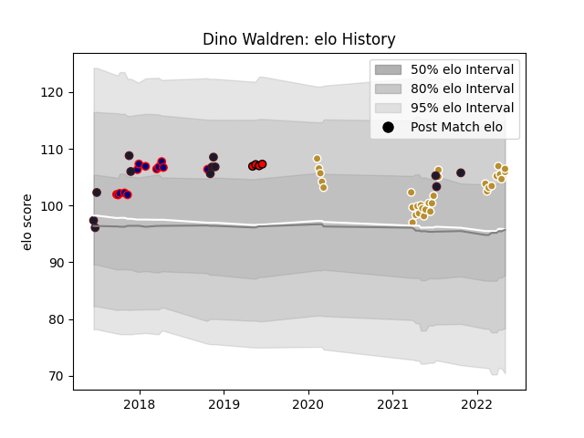

---  
layout: page  
title: Dino Waldren  
date: 2023-03-21 18:44:18.383658  
categories: player  
---
# Dino Waldren

Last updated: 2023-03-21
## Positions: P

## Country: United States of America

## Current elo: 106.0

## Current Percentile: 76.0

# Elo History

# Match History

| Team                     |   Appearances |   Win Rate |
|:-------------------------|--------------:|-----------:|
| NOLA Gold                |            31 |   0.532258 |
| London Scottish          |            13 |   0.346154 |
| United States of America |            12 |   0.375    |
| San Diego Legion         |             4 |   0.5      |

| Opponent               |   Matches |   Win Rate |
|:-----------------------|----------:|-----------:|
| New England Free Jacks |         5 |   0.6      |
| Toronto Arrows         |         5 |   0.4      |
| Rugby ATL              |         5 |   0        |
| Old Glory DC           |         4 |   0.875    |
| Rugby New York         |         3 |   0.666667 |
| R.U. New York          |         3 |   0.666667 |
| Canada                 |         2 |   0.75     |
| Seattle Seawolves      |         2 |   0.5      |
| San Diego Legion       |         2 |   0        |
| Ealing Trailfinders    |         2 |   0        |
| Utah Warriors          |         2 |   1        |
| Ireland                |         2 |   0        |
| Jersey                 |         2 |   0        |
| Georgia                |         2 |   0        |
| Samoa                  |         1 |   1        |
| Nottingham             |         1 |   1        |
| Rotherham Titans       |         1 |   1        |
| Romania                |         1 |   1        |
| Richmond               |         1 |   1        |
| Austin Gilgronis       |         1 |   0        |
| New Zealand Maori      |         1 |   0        |
| New Zealand            |         1 |   0        |
| Bedford                |         1 |   0.5      |
| NOLA Gold              |         1 |   1        |
| Houston SaberCats      |         1 |   1        |
| Hartpury College       |         1 |   0        |
| Germany                |         1 |   1        |
| England                |         1 |   0        |
| Doncaster              |         1 |   0        |
| Cornish Pirates        |         1 |   0        |
| Colorado Raptors       |         1 |   1        |
| Bristol Rugby          |         1 |   0        |
| Yorkshire Carnegie     |         1 |   1        |