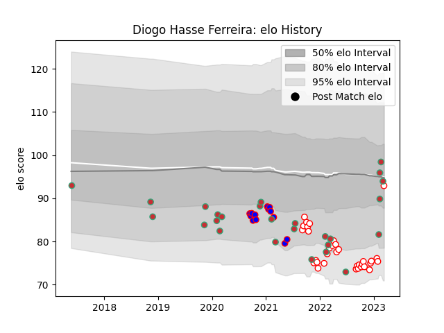

---  
layout: page  
title: Diogo Hasse Ferreira  
date: 2022-12-18 16:28:28.314107  
categories: player  
---
# Diogo Hasse Ferreira

## Positions: P

## Country: Portugal

## Current elo: 74.0

## Current Percentile: 2.0

# Elo History

# Match History

| Team     |   Appearances |   Win Rate |
|:---------|--------------:|-----------:|
| Dax      |            25 |   0.56     |
| Portugal |            14 |   0.392857 |
| Dijon    |             7 |   0.142857 |

| Opponent                   |   Matches |   Win Rate |
|:---------------------------|----------:|-----------:|
| Bourgoin-Jallieu           |         5 |   0.2      |
| US Bressane                |         3 |   0.666667 |
| Blagnac                    |         3 |   0.666667 |
| Chambery                   |         3 |   0.666667 |
| Suresnes                   |         3 |   0.333333 |
| Cognac Saint Jean d'Angély |         3 |   0.333333 |
| Georgia                    |         3 |   0.166667 |
| Albi                       |         2 |   0.5      |
| Brazil                     |         2 |   0.5      |
| Aubenas                    |         2 |   0.5      |
| Massy                      |         2 |   0        |
| Romania                    |         2 |   0        |
| Nice                       |         2 |   0.5      |
| Netherlands                |         1 |   1        |
| Tarbes                     |         1 |   1        |
| Spain                      |         1 |   0        |
| Italy                      |         1 |   0        |
| Narbonne                   |         1 |   1        |
| Namibia                    |         1 |   0        |
| Dijon                      |         1 |   0        |
| Chile                      |         1 |   1        |
| Canada                     |         1 |   1        |
| Belgium                    |         1 |   1        |
| Valence Romans Drome Rugby |         1 |   1        |