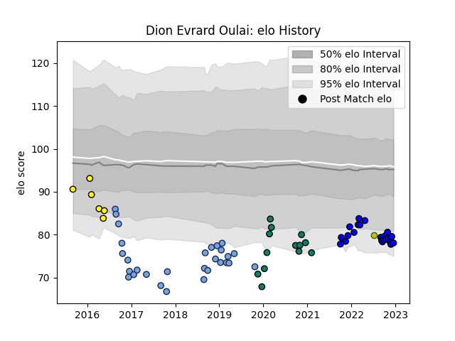

---  
layout: page  
title: Dion Evrard Oulai  
date: 2023-01-13 11:31:05.698025  
categories: player  
---
# Dion Evrard Oulai

## Positions: L, FL

## Country: Ivory Coast

## Current elo: 77.0

## Current Percentile: 9.0

# Elo History

# Match History

| Team        |   Appearances |   Win Rate |
|:------------|--------------:|-----------:|
| Bayonne     |            56 |   0.464286 |
| Massy       |            36 |   0.638889 |
| Montauban   |            24 |   0.458333 |
| Carcassonne |            23 |   0.391304 |
| Ivory Coast |             1 |   0        |

| Opponent                   |   Matches |   Win Rate |
|:---------------------------|----------:|-----------:|
| Soyaux-Angouleme           |         8 |   0.5      |
| Aurillac                   |         7 |   0.428571 |
| Beziers                    |         7 |   0.428571 |
| Biarritz Olympique         |         7 |   0.285714 |
| Colomiers                  |         6 |   0.333333 |
| Perpignan                  |         6 |   0.166667 |
| Carcassonne                |         6 |   0.333333 |
| Montauban                  |         5 |   0.6      |
| Provence Rugby             |         5 |   0.6      |
| Oyonnax                    |         5 |   0.4      |
| Mont-de-Marsan             |         5 |   0.5      |
| Massy                      |         4 |   1        |
| Albi                       |         4 |   0.25     |
| Bourgoin-Jallieu           |         4 |   0.75     |
| Nevers                     |         4 |   0.25     |
| Tarbes                     |         4 |   0.75     |
| Dax                        |         4 |   1        |
| Grenoble                   |         3 |   0.333333 |
| Vannes                     |         3 |   0.666667 |
| Gloucester Rugby           |         2 |   0        |
| Brive                      |         2 |   0.5      |
| Valence Romans Drome Rugby |         2 |   1        |
| US Bressane                |         2 |   1        |
| Toulon                     |         2 |   0.5      |
| Aubenas                    |         2 |   1        |
| Suresnes                   |         2 |   1        |
| Bayonne                    |         2 |   0        |
| Benetton Treviso           |         2 |   0        |
| Dijon                      |         2 |   1        |
| Agen                       |         2 |   0.5      |
| Nice                       |         2 |   0.5      |
| Narbonne                   |         2 |   0.5      |
| Montpellier Herault        |         2 |   0.5      |
| Chambery                   |         2 |   1        |
| Clermont Auvergne          |         2 |   0        |
| Pau                        |         1 |   1        |
| Castres Olympique          |         1 |   0.5      |
| Racing 92                  |         1 |   1        |
| Roval Drome XV             |         1 |   1        |
| Stade Francais Paris       |         1 |   0        |
| Stade Toulousain           |         1 |   0        |
| Cognac Saint Jean d'Angély |         1 |   1        |
| Lyon                       |         1 |   0        |
| Uganda                     |         1 |   0        |
| La Rochelle                |         1 |   0        |
| Blagnac                    |         1 |   0        |