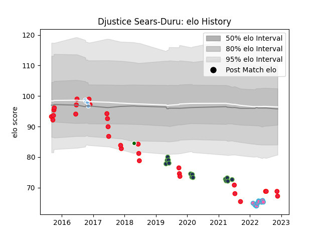

---  
layout: page  
title: Djustice Sears-Duru  
date: 2023-03-02 11:28:29.465159  
categories: player  
---
# Djustice Sears-Duru

## Positions: P

## Country: Canada

## Current elo: 76.0

## Current Percentile: 8.0

# Elo History

# Match History

| Team                |   Appearances |   Win Rate |
|:--------------------|--------------:|-----------:|
| Canada              |            42 |   0.25     |
| Seattle Seawolves   |            26 |   0.442308 |
| L. A. Giltinis      |            14 |   0.714286 |
| Glasgow Warriors    |             4 |   0.75     |
| Ealing Trailfinders |             3 |   0.833333 |

| Opponent                 |   Matches |   Win Rate |
|:-------------------------|----------:|-----------:|
| Utah Warriors            |         7 |  0.5       |
| United States of America |         6 |  0.0833333 |
| Toronto Arrows           |         5 |  0.4       |
| Houston SaberCats        |         4 |  0.5       |
| San Diego Legion         |         4 |  0.5       |
| Georgia                  |         3 |  0.333333  |
| Romania                  |         3 |  0         |
| Rugby New York           |         3 |  0.666667  |
| New England Free Jacks   |         3 |  0.666667  |
| Italy                    |         3 |  0         |
| R.U. New York            |         3 |  0.666667  |
| Fiji                     |         2 |  0         |
| Russia                   |         2 |  0.5       |
| Belgium                  |         2 |  1         |
| Portugal                 |         2 |  0.5       |
| Ireland                  |         2 |  0         |
| Seattle Seawolves        |         2 |  0.5       |
| Spain                    |         2 |  0.5       |
| Dallas Jackals           |         2 |  1         |
| Austin Gilgronis         |         2 |  0         |
| Yorkshire Carnegie       |         1 |  0.5       |
| Wales                    |         1 |  0         |
| Scarlets                 |         1 |  0         |
| Samoa                    |         1 |  0         |
| Scotland                 |         1 |  0         |
| Uruguay                  |         1 |  0         |
| South Africa             |         1 |  0         |
| Austin Elite Rugby       |         1 |  1         |
| Netherlands              |         1 |  1         |
| Old Glory DC             |         1 |  0         |
| New Zealand Maori        |         1 |  0         |
| Benetton Treviso         |         1 |  1         |
| Cornish Pirates          |         1 |  1         |
| Dragons                  |         1 |  1         |
| England                  |         1 |  0         |
| France                   |         1 |  0         |
| Germany                  |         1 |  1         |
| Glendale Raptors         |         1 |  1         |
| Hong Kong                |         1 |  1         |
| Japan                    |         1 |  0         |
| Jersey                   |         1 |  1         |
| Kenya                    |         1 |  1         |
| L. A. Giltinis           |         1 |  0         |
| NOLA Gold                |         1 |  1         |
| Namibia                  |         1 |  0         |
| New Zealand              |         1 |  0         |
| Zebre                    |         1 |  1         |