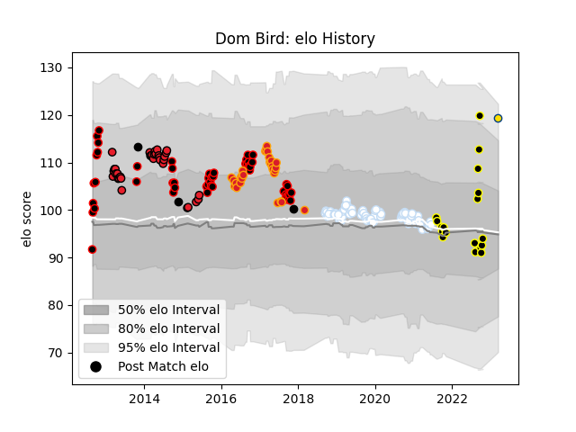

---  
layout: page  
title: Dom Bird  
date: 2023-03-29 11:28:25.441301  
categories: player  
---
# Dom Bird

Last updated: 2023-03-29
## Positions: L

## Country: New Zealand

## Current elo: 119.0

## Current Percentile: 45.0

# Elo History

# Match History

| Team        |   Appearances |   Win Rate |
|:------------|--------------:|-----------:|
| Racing 92   |            74 |   0.628378 |
| Canterbury  |            51 |   0.803922 |
| Crusaders   |            34 |   0.676471 |
| Chiefs      |            28 |   0.660714 |
| Wellington  |            18 |   0.722222 |
| New Zealand |             3 |   1        |
| Hurricanes  |             1 |   1        |

| Opponent                 |   Matches |   Win Rate |
|:-------------------------|----------:|-----------:|
| Tasman                   |        10 |   0.6      |
| Auckland                 |         8 |   1        |
| La Rochelle              |         8 |   0.375    |
| Blues                    |         8 |   0.6875   |
| Hurricanes               |         7 |   0.428571 |
| Highlanders              |         7 |   0.714286 |
| Taranaki                 |         7 |   0.571429 |
| Stade Toulousain         |         6 |   0.166667 |
| Hawke's Bay              |         6 |   0.833333 |
| Lyon                     |         6 |   0.333333 |
| Stormers                 |         5 |   0.8      |
| Stade Francais Paris     |         5 |   0.8      |
| New South Wales Waratahs |         5 |   0.6      |
| Melbourne Rebels         |         5 |   0.8      |
| Counties Manukau         |         5 |   1        |
| North Harbour            |         5 |   0.8      |
| Waikato                  |         5 |   0.8      |
| Bordeaux Begles          |         5 |   0.4      |
| Castres Olympique        |         4 |   0.75     |
| Montpellier Herault      |         4 |   1        |
| Otago                    |         4 |   1        |
| Pau                      |         4 |   0.75     |
| Crusaders                |         4 |   0.25     |
| Clermont Auvergne        |         4 |   0.875    |
| Southland                |         4 |   0.75     |
| Sharks                   |         4 |   0.5      |
| Northland                |         3 |   1        |
| Toulon                   |         3 |   0        |
| Queensland Reds          |         3 |   1        |
| Wellington               |         3 |   0.666667 |
| Agen                     |         3 |   0.833333 |
| Manawatu                 |         3 |   0.666667 |
| Bay of Plenty            |         3 |   0.666667 |
| Brive                    |         3 |   1        |
| Canterbury               |         3 |   0.666667 |
| Chiefs                   |         3 |   0.333333 |
| Saracens                 |         2 |   1        |
| Bayonne                  |         2 |   0        |
| Brumbies                 |         2 |   1        |
| Bulls                    |         2 |   1        |
| Cheetahs                 |         2 |   1        |
| Scarlets                 |         2 |   1        |
| Western Force            |         2 |   1        |
| Perpignan                |         2 |   1        |
| Grenoble                 |         2 |   1        |
| Leicester Tigers         |         2 |   1        |
| Munster                  |         2 |   0.75     |
| Exeter Chiefs            |         1 |   0        |
| Scotland                 |         1 |   1        |
| Lions                    |         1 |   1        |
| Southern Kings           |         1 |   1        |
| France                   |         1 |   1        |
| Ospreys                  |         1 |   1        |
| Sunwolves                |         1 |   1        |
| Harlequins               |         1 |   1        |
| Japan                    |         1 |   1        |
| British and Irish Lions  |         1 |   0        |
| Ulster                   |         1 |   1        |
| Connacht                 |         1 |   1        |