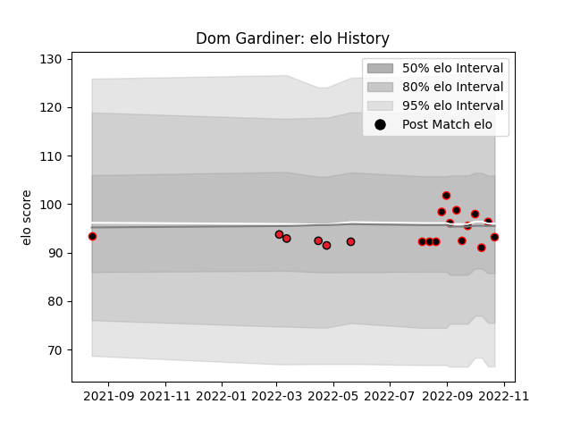

---  
layout: page  
title: Dom Gardiner  
date: 2023-03-24 11:46:59.451584  
categories: player  
---
# Dom Gardiner

Last updated: 2023-03-24
## Positions: L, FL

## Current elo: 93.0

## Current Percentile: 52.0

# Elo History

# Match History

| Team       |   Appearances |   Win Rate |
|:-----------|--------------:|-----------:|
| Canterbury |            14 |   0.857143 |
| Crusaders  |             5 |   0.6      |

| Opponent         |   Matches |   Win Rate |
|:-----------------|----------:|-----------:|
| Manawatu         |         2 |        1   |
| Northland        |         2 |        1   |
| Wellington       |         2 |        0.5 |
| Auckland         |         1 |        1   |
| Bay of Plenty    |         1 |        1   |
| Blues            |         1 |        0   |
| Chiefs           |         1 |        0   |
| Counties Manukau |         1 |        1   |
| Fijian Drua      |         1 |        1   |
| Hawke's Bay      |         1 |        1   |
| Melbourne Rebels |         1 |        1   |
| Moana Pasifika   |         1 |        1   |
| North Harbour    |         1 |        1   |
| Otago            |         1 |        1   |
| Taranaki         |         1 |        0   |
| Tasman           |         1 |        1   |