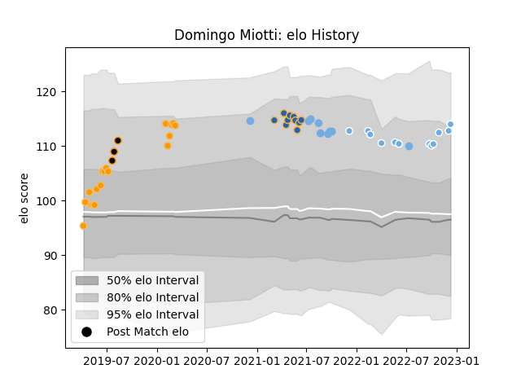

---  
layout: page  
title: Domingo Miotti  
date: 2022-12-31 16:28:31.468952  
categories: player  
---
# Domingo Miotti

## Positions: FH

## Country: Argentina

## Current elo: 105.0

## Current Percentile: 74.0

# Elo History

# Match History

| Team             |   Appearances |   Win Rate |
|:-----------------|--------------:|-----------:|
| Jaguares         |            18 |   0.722222 |
| Glasgow Warriors |            13 |   0.769231 |
| Argentina        |            11 |   0.272727 |
| Western Force    |            10 |   0.4      |
| Jaguares XV      |             4 |   1        |

| Opponent                 |   Matches |   Win Rate |
|:-------------------------|----------:|-----------:|
| Australia                |         3 |   0.166667 |
| Brumbies                 |         3 |   0.666667 |
| Bulls                    |         3 |   1        |
| Sharks                   |         3 |   0.666667 |
| New South Wales Waratahs |         3 |   1        |
| Hurricanes               |         3 |   0.333333 |
| Edinburgh                |         2 |   0.5      |
| Wales                    |         2 |   0.75     |
| Stormers                 |         2 |   0.5      |
| South Africa             |         2 |   0        |
| Queensland Reds          |         2 |   1        |
| Highlanders              |         2 |   0        |
| Zebre                    |         2 |   1        |
| Benetton Treviso         |         2 |   1        |
| Crusaders                |         2 |   0        |
| Chiefs                   |         2 |   0.5      |
| Eastern Province Kings   |         1 |   1        |
| Scotland                 |         1 |   0        |
| Valke                    |         1 |   1        |
| Uruguay                  |         1 |   0        |
| Sunwolves                |         1 |   1        |
| Blues                    |         1 |   0        |
| Border Bulldogs          |         1 |   1        |
| Cardiff Blues            |         1 |   1        |
| Romania                  |         1 |   1        |
| SWD Eagles               |         1 |   1        |
| Dragons                  |         1 |   1        |
| Ospreys                  |         1 |   0        |
| New Zealand              |         1 |   0        |
| Munster                  |         1 |   1        |
| Bath Rugby               |         1 |   1        |
| Lions                    |         1 |   1        |
| Leinster                 |         1 |   0        |
| Melbourne Rebels         |         1 |   1        |