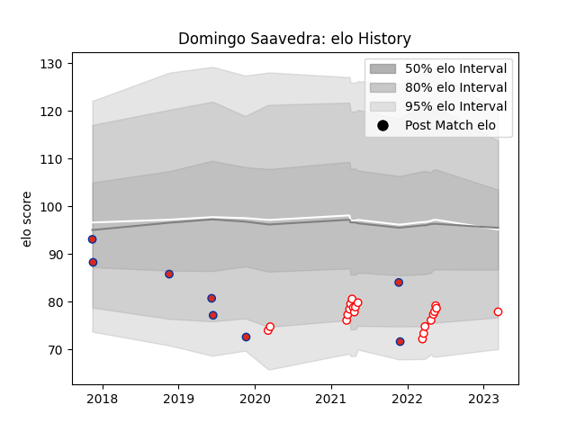

---  
layout: page  
title: Domingo Saavedra  
date: 2023-03-11 00:12:24.960432  
categories: player  
---
# Domingo Saavedra

## Positions: C

## Country: Chile

## Current elo: 78.0

## Current Percentile: 11.0

# Elo History

# Match History

| Team    |   Appearances |   Win Rate |
|:--------|--------------:|-----------:|
| Selknam |            20 |       0.65 |
| Chile   |             8 |       0.25 |

| Opponent          |   Matches |   Win Rate |
|:------------------|----------:|-----------:|
| Penarol Rugby     |         5 |   0.6      |
| Jaguares XV       |         4 |   0.75     |
| Olimpia Lions     |         4 |   0.5      |
| Cafeteros Pro     |         3 |   1        |
| Russia            |         3 |   0.666667 |
| Cobras            |         2 |   1        |
| Ceibos Rugby      |         1 |   0        |
| Dogos XV          |         1 |   0        |
| Hong Kong         |         1 |   0        |
| New Zealand Maori |         1 |   0        |
| Portugal          |         1 |   0        |
| Romania           |         1 |   0        |
| Spain             |         1 |   0        |