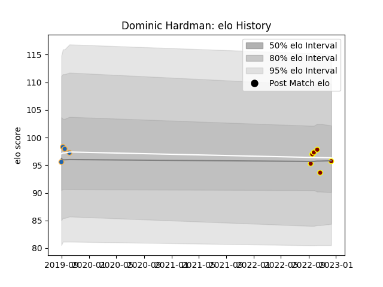

---  
layout: page  
title: Dominic Hardman  
date: 2023-01-21 15:39:22.895098  
categories: player  
---
# Dominic Hardman

## Positions: P

## Current elo: 98.0

## Current Percentile: 54.0

# Elo History

# Match History

| Team          |   Appearances |   Win Rate |
|:--------------|--------------:|-----------:|
| Ampthill      |             8 |     0.1875 |
| Western Force |             4 |     1      |

| Opponent            |   Matches |   Win Rate |
|:--------------------|----------:|-----------:|
| Ealing Trailfinders |         2 |        0   |
| Bedford             |         1 |        0   |
| Brisbane City       |         1 |        1   |
| Caldy               |         1 |        1   |
| Cornish Pirates     |         1 |        0   |
| Coventry            |         1 |        0   |
| Fijian Drua         |         1 |        1   |
| Jersey              |         1 |        0   |
| Melbourne Rising    |         1 |        1   |
| Queensland Country  |         1 |        1   |
| Richmond            |         1 |        0.5 |