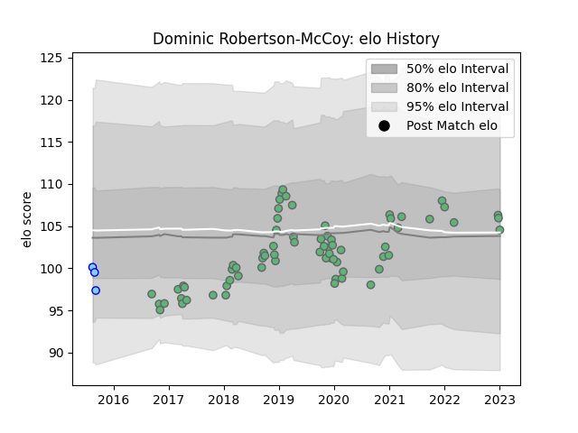

---  
layout: page  
title: Dominic Robertson-McCoy  
date: 2022-12-18 16:23:48.061799  
categories: player  
---
# Dominic Robertson-McCoy

## Positions: P

## Current elo: 98.0

## Current Percentile: None

# Elo History

# Match History

| Team      |   Appearances |   Win Rate |
|:----------|--------------:|-----------:|
| Connacht  |            65 |   0.515385 |
| Northland |             3 |   0        |

| Opponent             |   Matches |   Win Rate |
|:---------------------|----------:|-----------:|
| Leinster             |         7 |   0.142857 |
| Edinburgh            |         6 |   0.333333 |
| Zebre                |         5 |   0.8      |
| Munster              |         5 |   0.2      |
| Benetton Treviso     |         4 |   1        |
| Ospreys              |         4 |   0.5      |
| Cheetahs             |         4 |   0.75     |
| Cardiff Blues        |         4 |   0.5      |
| Ulster               |         3 |   0.333333 |
| Southern Kings       |         3 |   1        |
| Scarlets             |         3 |   0.333333 |
| Worcester Warriors   |         2 |   0.75     |
| Stade Toulousain     |         2 |   0        |
| Perpignan            |         2 |   1        |
| Montpellier Herault  |         2 |   0.5      |
| Gloucester Rugby     |         2 |   0.5      |
| Oyonnax              |         1 |   1        |
| Bordeaux Begles      |         1 |   1        |
| Sale Sharks          |         1 |   0        |
| Brive                |         1 |   1        |
| Stade Francais Paris |         1 |   1        |
| Hawke's Bay          |         1 |   0        |
| Taranaki             |         1 |   0        |
| Wellington           |         1 |   0        |
| Glasgow Warriors     |         1 |   0        |
| Dragons              |         1 |   0        |