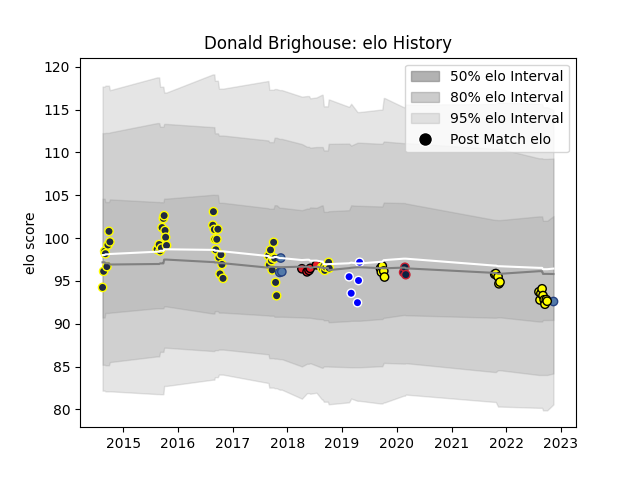

---  
layout: page  
title: Donald Brighouse  
date: 2022-11-22 11:36:09.844410  
categories: player  
---
# Donald Brighouse

## Positions: P

## Country: Samoa

## Current elo: 93.0

## Current Percentile: 34.0

# Elo History

# Match History

| Team                   |   Appearances |   Win Rate |
|:-----------------------|--------------:|-----------:|
| Otago                  |            48 |   0.541667 |
| Taranaki               |            19 |   0.421053 |
| Coventry               |             5 |   0.6      |
| Crusaders              |             5 |   1        |
| Samoa                  |             5 |   0.4      |
| New England Free Jacks |             3 |   0        |

| Opponent                 |   Matches |   Win Rate |
|:-------------------------|----------:|-----------:|
| Bay of Plenty            |         9 |   0.444444 |
| Southland                |         8 |   1        |
| Auckland                 |         6 |   0.333333 |
| Tasman                   |         6 |   0.166667 |
| Wellington               |         6 |   0.333333 |
| Canterbury               |         5 |   0.2      |
| Manawatu                 |         5 |   1        |
| North Harbour            |         5 |   0.6      |
| Northland                |         5 |   0.6      |
| Waikato                  |         4 |   0.5      |
| Hawke's Bay              |         4 |   0.25     |
| Counties Manukau         |         2 |   0        |
| Romania                  |         2 |   0.5      |
| Richmond                 |         1 |   1        |
| Utah Warriors            |         1 |   0        |
| Blues                    |         1 |   1        |
| Taranaki                 |         1 |   1        |
| Seattle Seawolves        |         1 |   0        |
| Scotland                 |         1 |   0        |
| San Diego Legion         |         1 |   0        |
| Nottingham               |         1 |   0        |
| Otago                    |         1 |   1        |
| Doncaster                |         1 |   1        |
| Chiefs                   |         1 |   1        |
| London Irish             |         1 |   0        |
| Jersey                   |         1 |   1        |
| Jaguares                 |         1 |   1        |
| Hurricanes               |         1 |   1        |
| Georgia                  |         1 |   1        |
| England                  |         1 |   0        |
| New South Wales Waratahs |         1 |   1        |