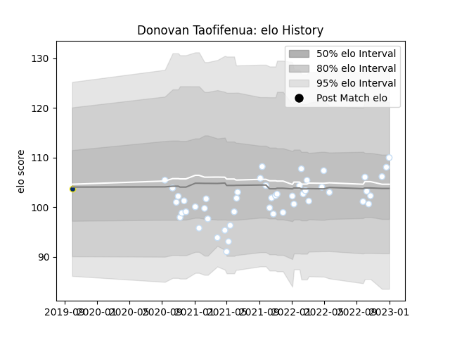

---  
layout: page  
title: Donovan Taofifenua  
date: 2023-01-06 00:26:15.150659  
categories: player  
---
# Donovan Taofifenua

## Positions: W

## Current elo: 110.0

## Current Percentile: 65.0

# Elo History

# Match History

| Team              |   Appearances |   Win Rate |
|:------------------|--------------:|-----------:|
| Racing 92         |            49 |   0.642857 |
| Clermont Auvergne |             1 |   1        |

| Opponent             |   Matches |   Win Rate |
|:---------------------|----------:|-----------:|
| Pau                  |         5 |   1        |
| Stade Francais Paris |         5 |   0.8      |
| Stade Toulousain     |         5 |   0.4      |
| Brive                |         4 |   0.75     |
| Castres Olympique    |         4 |   0.625    |
| La Rochelle          |         4 |   0.5      |
| Montpellier Herault  |         4 |   0.5      |
| Bordeaux Begles      |         3 |   0.333333 |
| Clermont Auvergne    |         3 |   1        |
| Lyon                 |         3 |   0.666667 |
| Toulon               |         3 |   0.666667 |
| Bayonne              |         2 |   0.5      |
| Perpignan            |         2 |   0.5      |
| Agen                 |         1 |   1        |
| Biarritz Olympique   |         1 |   1        |
| Harlequins           |         1 |   0        |