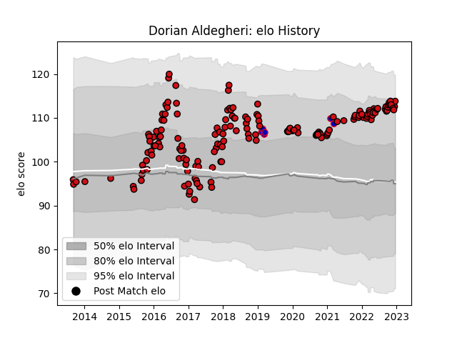

---  
layout: page  
title: Dorian Aldegheri  
date: 2023-03-20 15:46:30.362895  
categories: player  
---
# Dorian Aldegheri

Last updated: 2023-03-20
## Positions: P

## Country: France

## Current elo: 114.0

## Current Percentile: 87.0

# Elo History

# Match History

| Team             |   Appearances |   Win Rate |
|:-----------------|--------------:|-----------:|
| Stade Toulousain |           165 |    0.60303 |
| France           |             6 |    0.5     |

| Opponent             |   Matches |   Win Rate |
|:---------------------|----------:|-----------:|
| Castres Olympique    |        12 |   0.25     |
| Clermont Auvergne    |        12 |   0.541667 |
| La Rochelle          |        12 |   0.666667 |
| Toulon               |        11 |   0.590909 |
| Montpellier Herault  |        11 |   0.727273 |
| Stade Francais Paris |        11 |   0.681818 |
| Racing 92            |        10 |   0.6      |
| Bordeaux Begles      |        10 |   0.65     |
| Brive                |        10 |   0.85     |
| Lyon                 |        10 |   0.45     |
| Pau                  |         7 |   0.428571 |
| Oyonnax              |         7 |   0.785714 |
| Agen                 |         6 |   1        |
| Grenoble             |         5 |   0.8      |
| Wasps                |         5 |   0.5      |
| Bayonne              |         4 |   0.25     |
| Ulster               |         3 |   0.333333 |
| Connacht             |         3 |   0.666667 |
| Munster              |         3 |   0.5      |
| Sale Sharks          |         2 |   1        |
| Leinster             |         2 |   0        |
| Italy                |         2 |   1        |
| Gloucester Rugby     |         2 |   1        |
| England              |         2 |   0        |
| Cardiff Blues        |         2 |   0.5      |
| Bath Rugby           |         1 |   1        |
| Perpignan            |         1 |   1        |
| Ireland              |         1 |   0        |
| Saracens             |         1 |   0        |
| Scotland             |         1 |   1        |
| Exeter Chiefs        |         1 |   0        |
| Zebre                |         1 |   1        |