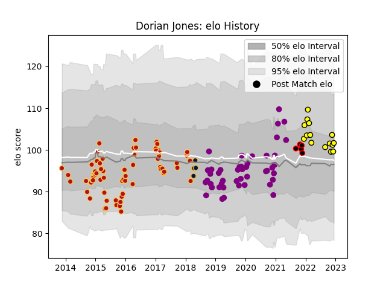

---  
layout: page  
title: Dorian Jones  
date: 2022-12-18 16:38:02.293023  
categories: player  
---
# Dorian Jones

## Positions: FH

## Current elo: 99.0

## Current Percentile: 69.0

# Elo History

# Match History

| Team               |   Appearances |   Win Rate |
|:-------------------|--------------:|-----------:|
| Dragons            |            69 |   0.376812 |
| Soyaux-Angouleme   |            45 |   0.477778 |
| Carcassonne        |            16 |   0.625    |
| Nice               |             5 |   0.6      |
| Worcester Warriors |             4 |   0.5      |

| Opponent                   |   Matches |   Win Rate |
|:---------------------------|----------:|-----------:|
| Zebre                      |         5 |   0.4      |
| Connacht                   |         5 |   0.2      |
| Aurillac                   |         5 |   0.8      |
| Oyonnax                    |         5 |   0        |
| Biarritz Olympique         |         5 |   0.4      |
| Ospreys                    |         5 |   0.2      |
| Newcastle Falcons          |         5 |   0.4      |
| Cardiff Blues              |         5 |   0.4      |
| Grenoble                   |         5 |   0.2      |
| Edinburgh                  |         5 |   0.2      |
| Ulster                     |         4 |   0.25     |
| Scarlets                   |         4 |   0        |
| Munster                    |         4 |   0.25     |
| Montauban                  |         4 |   0.75     |
| Glasgow Warriors           |         4 |   0.25     |
| Mont-de-Marsan             |         4 |   0.5      |
| Valence Romans Drome Rugby |         3 |   0.5      |
| US Bressane                |         3 |   0.666667 |
| Leinster                   |         3 |   0.666667 |
| Benetton Treviso           |         3 |   1        |
| Carcassonne                |         3 |   0.5      |
| Provence Rugby             |         3 |   0.333333 |
| Nevers                     |         3 |   0.833333 |
| Beziers                    |         3 |   0.666667 |
| Bordeaux Begles            |         2 |   0.5      |
| Colomiers                  |         2 |   0.5      |
| Wasps                      |         2 |   0.5      |
| Vannes                     |         2 |   0.5      |
| Bayonne                    |         2 |   0.5      |
| Rouen                      |         2 |   1        |
| Perpignan                  |         2 |   0        |
| Pau                        |         2 |   1        |
| Agen                       |         2 |   0.5      |
| Massy                      |         2 |   0.5      |
| Narbonne                   |         2 |   1        |
| Bucuresti                  |         2 |   1        |
| Gloucester Rugby           |         2 |   0.5      |
| Harlequins                 |         2 |   0.5      |
| Southern Kings             |         1 |   0        |
| Exeter Chiefs              |         1 |   0        |
| Cognac Saint Jean d'Angély |         1 |   1        |
| Castres Olympique          |         1 |   0        |
| Stade Francais Paris       |         1 |   1        |
| Northampton Saints         |         1 |   0        |
| Brive                      |         1 |   0        |
| Sale Sharks                |         1 |   1        |
| Roval Drome XV             |         1 |   0        |
| Aubenas                    |         1 |   1        |
| RC Enisei                  |         1 |   1        |
| Montpellier Herault        |         1 |   0        |
| Dijon                      |         1 |   1        |