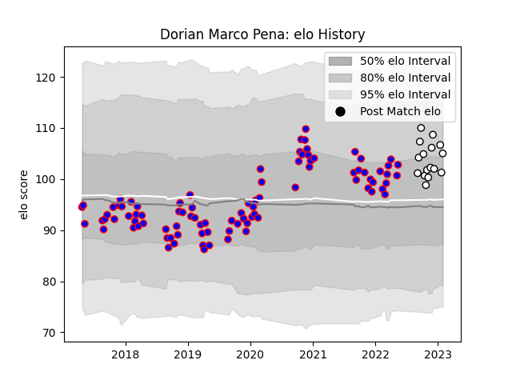

---  
layout: page  
title: Dorian Marco Pena  
date: 2023-03-21 18:23:12.755887  
categories: player  
---
# Dorian Marco Pena

Last updated: 2023-03-21
## Positions: H

## Current elo: 110.0

## Current Percentile: 84.0

# Elo History

# Match History

| Team                       |   Appearances |   Win Rate |
|:---------------------------|--------------:|-----------:|
| Beziers                    |            90 |   0.494444 |
| Valence Romans Drome Rugby |            20 |   0.675    |

| Opponent                   |   Matches |   Win Rate |
|:---------------------------|----------:|-----------:|
| Vannes                     |         8 |   0.5      |
| Montauban                  |         6 |   0.75     |
| Aurillac                   |         6 |   0.666667 |
| Carcassonne                |         6 |   0.666667 |
| Nevers                     |         6 |   0.416667 |
| Colomiers                  |         6 |   0.5      |
| Provence Rugby             |         5 |   0.4      |
| Narbonne                   |         5 |   0.8      |
| Bayonne                    |         4 |   0.5      |
| Biarritz Olympique         |         4 |   0        |
| US Bressane                |         4 |   0.25     |
| Rouen                      |         4 |   0.5      |
| Oyonnax                    |         4 |   0        |
| Grenoble                   |         4 |   0.25     |
| Massy                      |         4 |   1        |
| Perpignan                  |         3 |   0.333333 |
| Mont-de-Marsan             |         3 |   0.333333 |
| Albi                       |         2 |   0        |
| Dax                        |         2 |   0.5      |
| Nice                       |         2 |   0.5      |
| Carqueiranne-Hyères        |         2 |   1        |
| Brive                      |         2 |   0.5      |
| Rennes                     |         2 |   1        |
| Bourgoin-Jallieu           |         2 |   0.75     |
| Roval Drome XV             |         2 |   1        |
| Soyaux-Angouleme           |         2 |   0        |
| Suresnes                   |         2 |   1        |
| Blagnac                    |         2 |   0.5      |
| Agen                       |         2 |   1        |
| Cognac Saint Jean d'Angély |         1 |   1        |
| Chambery                   |         1 |   0        |
| Tarbes                     |         1 |   1        |
| Valence Romans Drome Rugby |         1 |   0.5      |