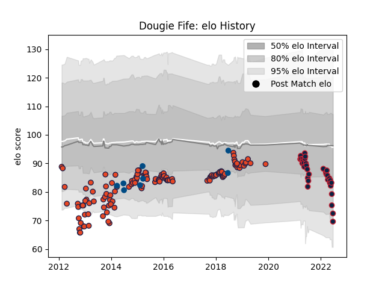

---  
layout: page  
title: Dougie Fife  
date: 2023-03-02 11:28:12.930839  
categories: player  
---
# Dougie Fife

## Positions: W, FB

## Country: Scotland

## Current elo: 70.0

## Current Percentile: 17.0

# Elo History

# Match History

| Team                   |   Appearances |   Win Rate |
|:-----------------------|--------------:|-----------:|
| Edinburgh              |           132 |   0.454545 |
| New England Free Jacks |            33 |   0.636364 |
| Scotland               |             8 |   0.25     |

| Opponent                 |   Matches |   Win Rate |
|:-------------------------|----------:|-----------:|
| Munster                  |        12 |   0.25     |
| Dragons                  |        11 |   0.636364 |
| Glasgow Warriors         |        10 |   0.5      |
| Cardiff Blues            |        10 |   0.2      |
| Leinster                 |        10 |   0.4      |
| Ulster                   |         9 |   0.222222 |
| Benetton Treviso         |         9 |   0.777778 |
| Connacht                 |         9 |   0.555556 |
| Ospreys                  |         8 |   0.375    |
| Scarlets                 |         7 |   0.428571 |
| Zebre                    |         6 |   0.5      |
| NOLA Gold                |         5 |   0.6      |
| R.U. New York            |         4 |   0.25     |
| Toronto Arrows           |         4 |   0.75     |
| Southern Kings           |         4 |   0.75     |
| London Irish             |         4 |   0.75     |
| Rugby New York           |         4 |   0.25     |
| Rugby ATL                |         4 |   0.75     |
| Gloucester Rugby         |         4 |   0.25     |
| Agen                     |         3 |   1        |
| Old Glory DC             |         3 |   0.666667 |
| Utah Warriors            |         2 |   1        |
| Austin Gilgronis         |         2 |   1        |
| Seattle Seawolves        |         2 |   1        |
| Bordeaux Begles          |         2 |   1        |
| Saracens                 |         2 |   0        |
| Racing 92                |         2 |   0        |
| Perpignan                |         2 |   0.5      |
| Argentina                |         2 |   1        |
| Grenoble                 |         2 |   0.5      |
| Stade Francais Paris     |         1 |   0        |
| Wales                    |         1 |   0        |
| United States of America |         1 |   0        |
| Houston SaberCats        |         1 |   1        |
| Toulon                   |         1 |   1        |
| Ireland                  |         1 |   0        |
| L. A. Giltinis           |         1 |   0        |
| Cheetahs                 |         1 |   0        |
| South Africa             |         1 |   0        |
| England                  |         1 |   0        |
| London Welsh             |         1 |   1        |
| Lyon                     |         1 |   0        |
| San Diego Legion         |         1 |   1        |
| Montpellier Herault      |         1 |   0        |
| France                   |         1 |   0        |