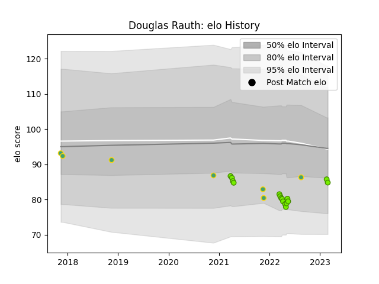

---  
layout: page  
title: Douglas Rauth  
date: 2023-03-21 18:38:20.440595  
categories: player  
---
# Douglas Rauth

Last updated: 2023-03-21
## Positions: SH

## Country: Brazil

## Current elo: 85.0

## Current Percentile: 22.0

# Elo History

# Match History

| Team   |   Appearances |   Win Rate |
|:-------|--------------:|-----------:|
| Cobras |            18 |   0.111111 |
| Brazil |             7 |   0        |

| Opponent          |   Matches |   Win Rate |
|:------------------|----------:|-----------:|
| Penarol Rugby     |         4 |   0        |
| Selknam           |         4 |   0.25     |
| Jaguares XV       |         3 |   0        |
| Olimpia Lions     |         3 |   0.333333 |
| Cafeteros Pro     |         2 |   0        |
| Chile             |         1 |   0        |
| Dogos XV          |         1 |   0        |
| Germany           |         1 |   0        |
| Kenya             |         1 |   0        |
| New Zealand Maori |         1 |   0        |
| Pampas XV         |         1 |   0        |
| Portugal          |         1 |   0        |
| Spain             |         1 |   0        |
| Zimbabwe          |         1 |   0        |