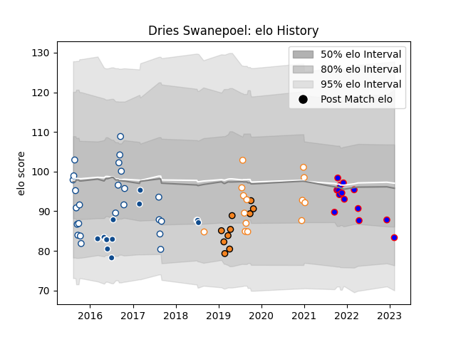

---  
layout: page  
title: Dries Swanepoel  
date: 2022-12-14 11:29:53.206912  
categories: player  
---
# Dries Swanepoel

## Positions: C

## Current elo: 102.0

## Current Percentile: 69.0

# Elo History

# Match History

| Team                |   Appearances |   Win Rate |
|:--------------------|--------------:|-----------:|
| Blue Bulls          |            19 |   0.631579 |
| Beziers             |            13 |   0.423077 |
| Bulls               |            13 |   0.461538 |
| Free State Cheetahs |            10 |   0.6      |
| Cheetahs            |             8 |   0.375    |

| Opponent                 |   Matches |   Win Rate |
|:-------------------------|----------:|-----------:|
| Western Province         |         7 |   0.285714 |
| Pumas                    |         5 |   0.8      |
| Griquas                  |         5 |   1        |
| Natal Sharks             |         4 |   0.5      |
| Golden Lions             |         3 |   0.333333 |
| Lions                    |         2 |   0        |
| Oyonnax                  |         2 |   0.25     |
| Cheetahs                 |         2 |   0.5      |
| Colomiers                |         2 |   0.5      |
| Connacht                 |         2 |   0        |
| Sunwolves                |         2 |   0.5      |
| Stormers                 |         2 |   0.5      |
| Free State Cheetahs      |         2 |   0.5      |
| Jaguares                 |         2 |   0.5      |
| Ospreys                  |         1 |   0        |
| Rouen                    |         1 |   1        |
| Agen                     |         1 |   1        |
| Scarlets                 |         1 |   0        |
| New South Wales Waratahs |         1 |   0        |
| US Bressane              |         1 |   0        |
| Western Force            |         1 |   1        |
| Southern Kings           |         1 |   1        |
| Melbourne Rebels         |         1 |   1        |
| Narbonne                 |         1 |   1        |
| Montauban                |         1 |   0        |
| Mont-de-Marsan           |         1 |   0        |
| Bayonne                  |         1 |   0        |
| Grenoble                 |         1 |   1        |
| Glasgow Warriors         |         1 |   0        |
| Eastern Province Kings   |         1 |   1        |
| Dragons                  |         1 |   1        |
| Carcassonne              |         1 |   0        |
| Boland Cavaliers         |         1 |   1        |
| Blue Bulls               |         1 |   1        |
| Zebre                    |         1 |   1        |