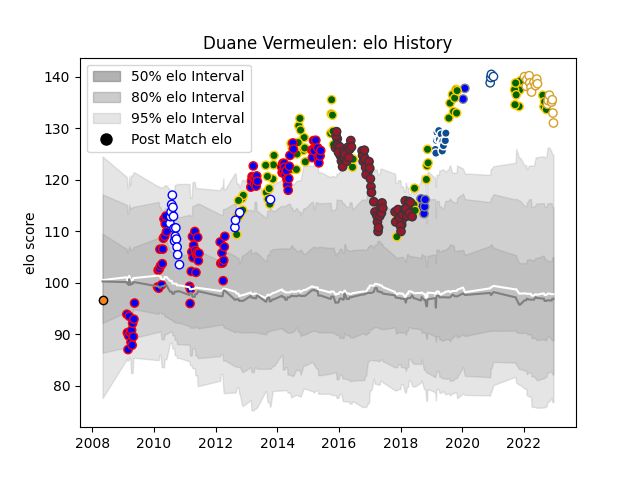

---  
layout: page  
title: Duane Vermeulen  
date: 2022-12-09 13:13:15.290956  
categories: player  
---
# Duane Vermeulen

## Positions: N8

## Country: South Africa

## Current elo: 136.0

## Current Percentile: 98.0

# Elo History

# Match History

| Team                              |   Appearances |   Win Rate |
|:----------------------------------|--------------:|-----------:|
| Stormers                          |            89 |   0.595506 |
| Toulon                            |            68 |   0.573529 |
| South Africa                      |            65 |   0.669231 |
| Western Province                  |            19 |   0.684211 |
| Ulster                            |            16 |   0.6875   |
| Bulls                             |            14 |   0.5      |
| Kubota Spears Funabashi Tokyo-Bay |             7 |   0.571429 |
| Blue Bulls                        |             4 |   0.75     |
| Cheetahs                          |             1 |   0        |

| Opponent                  |   Matches |   Win Rate |
|:--------------------------|----------:|-----------:|
| Sharks                    |        13 |   0.692308 |
| New Zealand               |        12 |   0.208333 |
| Bulls                     |        12 |   0.5      |
| Lions                     |        11 |   0.909091 |
| Australia                 |        10 |   0.5      |
| Cheetahs                  |         9 |   0.666667 |
| Wales                     |         8 |   0.75     |
| England                   |         8 |   0.625    |
| Chiefs                    |         7 |   0.285714 |
| Hurricanes                |         7 |   0.571429 |
| Crusaders                 |         7 |   0.142857 |
| Brumbies                  |         7 |   0.428571 |
| Argentina                 |         7 |   1        |
| New South Wales Waratahs  |         6 |   0.5      |
| Highlanders               |         6 |   0.833333 |
| Blues                     |         6 |   0.666667 |
| Scotland                  |         6 |   1        |
| Natal Sharks              |         5 |   0.4      |
| Queensland Reds           |         5 |   0.4      |
| Lyon                      |         5 |   0.5      |
| Clermont Auvergne         |         5 |   0.2      |
| Castres Olympique         |         5 |   0.8      |
| Scarlets                  |         4 |   0.5      |
| Brive                     |         4 |   0.5      |
| Bath Rugby                |         4 |   0.75     |
| Munster                   |         4 |   0.5      |
| Western Force             |         4 |   0.75     |
| La Rochelle               |         4 |   0.625    |
| Stormers                  |         4 |   0.25     |
| Stade Toulousain          |         4 |   0.25     |
| Ireland                   |         4 |   0.5      |
| Montpellier Herault       |         4 |   0.5      |
| Stade Francais Paris      |         4 |   0.75     |
| Golden Lions              |         4 |   0.5      |
| Free State Cheetahs       |         4 |   0.75     |
| Leinster                  |         4 |   0.75     |
| Oyonnax                   |         3 |   0.666667 |
| Racing 92                 |         3 |   0.333333 |
| Agen                      |         3 |   0.666667 |
| Melbourne Rebels          |         3 |   1        |
| Bordeaux Begles           |         3 |   0.666667 |
| Italy                     |         3 |   1        |
| Griquas                   |         3 |   1        |
| France                    |         3 |   1        |
| Grenoble                  |         2 |   1        |
| Wasps                     |         2 |   0.5      |
| Blue Bulls                |         2 |   0.5      |
| Sale Sharks               |         2 |   1        |
| Saitama Wild Knights      |         2 |   0        |
| Saracens                  |         2 |   0        |
| Pumas                     |         2 |   1        |
| Jaguares                  |         2 |   0        |
| Leopards                  |         2 |   1        |
| Japan                     |         2 |   1        |
| Pau                       |         2 |   1        |
| Western Province          |         1 |   1        |
| Benetton Treviso          |         1 |   1        |
| Black Rams Tokyo          |         1 |   1        |
| United States of America  |         1 |   1        |
| Toshiba Brave Lupus Tokyo |         1 |   1        |
| Cardiff Blues             |         1 |   1        |
| Shizuoka Blue Revs        |         1 |   0        |
| Coca-Cola Red Sparks      |         1 |   1        |
| Connacht                  |         1 |   1        |
| Edinburgh                 |         1 |   1        |
| Munakata Sanix Blues      |         1 |   1        |
| Samoa                     |         1 |   1        |
| Ospreys                   |         1 |   1        |
| Zebre                     |         1 |   1        |