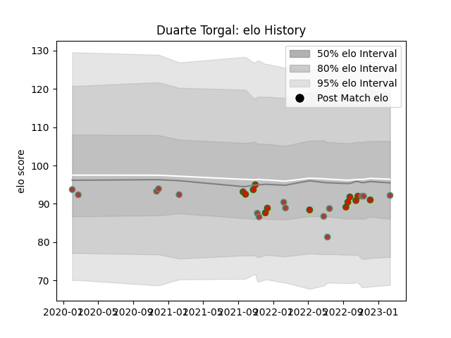

---  
layout: page  
title: Duarte Torgal  
date: 2023-02-15 22:14:08.342437  
categories: player  
---
# Duarte Torgal

## Positions: L

## Country: Portugal

## Current elo: 92.0

## Current Percentile: 36.0

# Elo History

# Match History

| Team         |   Appearances |   Win Rate |
|:-------------|--------------:|-----------:|
| Portugal     |            15 |   0.5      |
| Lusitanos XV |            13 |   0.769231 |

| Opponent                 |   Matches |   Win Rate |
|:-------------------------|----------:|-----------:|
| Brussels Devils          |         4 |       1    |
| Castilla y Leon Iberians |         4 |       0.75 |
| Delta                    |         3 |       1    |
| Brazil                   |         2 |       1    |
| Georgia                  |         2 |       0.25 |
| Argentina                |         1 |       0    |
| Kenya                    |         1 |       1    |
| Spain                    |         1 |       0    |
| Russia                   |         1 |       0    |
| Romania                  |         1 |       0    |
| Poland                   |         1 |       1    |
| Hong Kong                |         1 |       1    |
| Japan                    |         1 |       0    |
| Italy                    |         1 |       0    |
| Belgium                  |         1 |       1    |
| Canada                   |         1 |       1    |
| Black Lion               |         1 |       0    |
| Tel-Aviv Heat            |         1 |       0    |