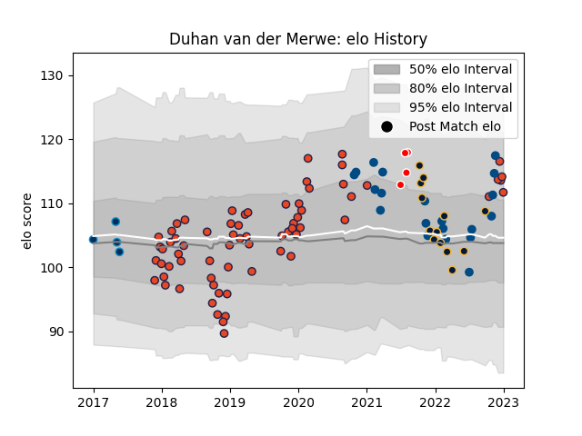

---  
layout: page  
title: Duhan van der Merwe  
date: 2022-11-15 23:43:10.305251  
categories: player  
---
# Duhan van der Merwe

## Positions: W

## Country: Scotland

## Current elo: 95.0

## Current Percentile: 34.0

# Elo History

# Match History

| Team                    |   Appearances |   Win Rate |
|:------------------------|--------------:|-----------:|
| Edinburgh               |            63 |   0.674603 |
| Scotland                |            19 |   0.526316 |
| Worcester Warriors      |            13 |   0.384615 |
| British and Irish Lions |             4 |   0.5      |
| Montpellier Herault     |             4 |   0.25     |

| Opponent             |   Matches |   Win Rate |
|:---------------------|----------:|-----------:|
| Glasgow Warriors     |        12 |   0.666667 |
| Munster              |         6 |   0.333333 |
| Scarlets             |         5 |   1        |
| Newcastle Falcons    |         4 |   0.75     |
| Cardiff Blues        |         4 |   0.5      |
| South Africa         |         4 |   0.25     |
| Dragons              |         4 |   0.75     |
| Ulster               |         4 |   0.25     |
| Southern Kings       |         4 |   1        |
| Leinster             |         3 |   0.666667 |
| Argentina            |         3 |   0.333333 |
| Connacht             |         3 |   1        |
| Wales                |         3 |   0.333333 |
| Stade Francais Paris |         3 |   0.666667 |
| Zebre                |         2 |   0.5      |
| Japan                |         2 |   1        |
| Northampton Saints   |         2 |   0        |
| France               |         2 |   0.5      |
| England              |         2 |   1        |
| Cheetahs             |         2 |   0.5      |
| Wasps                |         2 |   1        |
| Bordeaux Begles      |         2 |   0.25     |
| Benetton Treviso     |         2 |   1        |
| Bath Rugby           |         2 |   0.5      |
| Australia            |         2 |   0.5      |
| Pau                  |         1 |   0        |
| Saracens             |         1 |   0        |
| Sale Sharks          |         1 |   1        |
| Racing 92            |         1 |   0        |
| Toulon               |         1 |   1        |
| Agen                 |         1 |   1        |
| Ospreys              |         1 |   0        |
| New Zealand          |         1 |   0        |
| Montpellier Herault  |         1 |   1        |
| London Irish         |         1 |   0        |
| La Rochelle          |         1 |   0        |
| Krasny Yar           |         1 |   1        |
| Italy                |         1 |   1        |
| Ireland              |         1 |   0        |
| Georgia              |         1 |   1        |
| Fiji                 |         1 |   1        |
| Exeter Chiefs        |         1 |   0        |
| Bristol Rugby        |         1 |   1        |
| Leicester Tigers     |         1 |   0        |