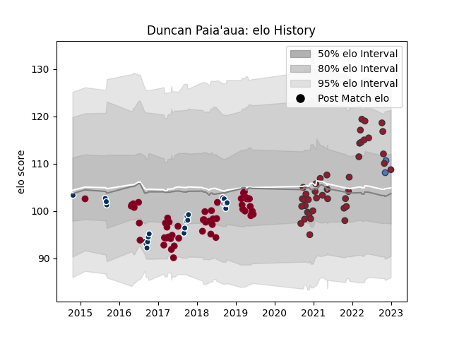

---  
layout: page  
title: Duncan Paia'aua  
date: 2023-01-06 00:21:44.986981  
categories: player  
---
# Duncan Paia'aua

## Positions: C

## Country: Samoa

## Current elo: 109.0

## Current Percentile: 71.0

# Elo History

# Match History

| Team               |   Appearances |   Win Rate |
|:-------------------|--------------:|-----------:|
| Queensland Reds    |            52 |   0.346154 |
| Toulon             |            41 |   0.573171 |
| Queensland Country |            23 |   0.478261 |
| Samoa              |             2 |   0.5      |

| Opponent                 |   Matches |   Win Rate |
|:-------------------------|----------:|-----------:|
| Brumbies                 |         7 |   0.428571 |
| Melbourne Rebels         |         6 |   0.333333 |
| Sunwolves                |         5 |   0.8      |
| New South Wales Waratahs |         4 |   0        |
| Clermont Auvergne        |         4 |   0.5      |
| Lyon                     |         4 |   0.75     |
| Melbourne Rising         |         4 |   0.5      |
| La Rochelle              |         4 |   0.25     |
| Racing 92                |         4 |   0.5      |
| Brisbane City            |         4 |   0.25     |
| Highlanders              |         3 |   0        |
| NSW Country Eagles       |         3 |   1        |
| Montpellier Herault      |         3 |   0.333333 |
| Stade Toulousain         |         3 |   0.666667 |
| Stormers                 |         3 |   0.333333 |
| Jaguares                 |         3 |   0.333333 |
| Hurricanes               |         3 |   0        |
| Western Force            |         3 |   0        |
| Blues                    |         3 |   0.333333 |
| Brive                    |         3 |   0.666667 |
| Canberra Vikings         |         3 |   0.333333 |
| Chiefs                   |         3 |   0        |
| Castres Olympique        |         2 |   1        |
| Stade Francais Paris     |         2 |   0.5      |
| Pau                      |         2 |   0.75     |
| Bordeaux Begles          |         2 |   0.5      |
| Bulls                    |         2 |   0.5      |
| Greater Sydney Rams      |         2 |   0.5      |
| Sharks                   |         2 |   1        |
| Lions                    |         2 |   0.5      |
| Biarritz Olympique       |         2 |   1        |
| Bayonne                  |         2 |   0        |
| Crusaders                |         2 |   0        |
| Sydney Rays              |         2 |   1        |
| Sydney Stars             |         1 |   0        |
| Southern Kings           |         1 |   1        |
| North Harbour Rays       |         1 |   0        |
| Scarlets                 |         1 |   1        |
| Bristol Rugby            |         1 |   0        |
| Perth Spirit             |         1 |   0        |
| Georgia                  |         1 |   1        |
| Cheetahs                 |         1 |   1        |
| Leicester Tigers         |         1 |   1        |
| Italy                    |         1 |   0        |
| Fijian Drua              |         1 |   1        |
| Agen                     |         1 |   1        |