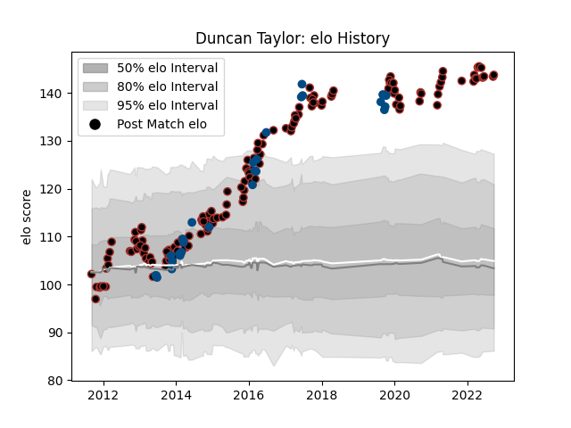

---  
layout: page  
title: Duncan Taylor  
date: 2023-01-05 11:28:58.930493  
categories: player  
---
# Duncan Taylor

## Positions: C, W

## Country: Scotland

## Current elo: 132.0

## Current Percentile: 99.0

# Elo History

# Match History

| Team     |   Appearances |   Win Rate |
|:---------|--------------:|-----------:|
| Saracens |           149 |   0.785235 |
| Scotland |            27 |   0.481481 |

| Opponent                 |   Matches |   Win Rate |
|:-------------------------|----------:|-----------:|
| Northampton Saints       |        15 |   0.666667 |
| Sale Sharks              |        14 |   0.857143 |
| Bath Rugby               |        13 |   0.846154 |
| Leicester Tigers         |        10 |   0.65     |
| Wasps                    |        10 |   0.8      |
| Worcester Warriors       |         9 |   0.888889 |
| Harlequins               |         9 |   0.888889 |
| Gloucester Rugby         |         9 |   0.611111 |
| Exeter Chiefs            |         9 |   0.5      |
| London Irish             |         8 |   0.8125   |
| Racing 92                |         5 |   0.6      |
| Stade Toulousain         |         4 |   0.5      |
| Newcastle Falcons        |         4 |   1        |
| London Welsh             |         4 |   1        |
| Italy                    |         4 |   1        |
| France                   |         3 |   0.333333 |
| Ireland                  |         3 |   0        |
| Samoa                    |         2 |   0.5      |
| South Africa             |         2 |   0        |
| Munster                  |         2 |   0.5      |
| Ulster                   |         2 |   1        |
| Wales                    |         2 |   0        |
| Ospreys                  |         2 |   1        |
| Australia                |         2 |   0.5      |
| Zebre                    |         2 |   1        |
| Japan                    |         2 |   1        |
| Bristol Rugby            |         2 |   1        |
| England                  |         2 |   0        |
| Connacht                 |         2 |   1        |
| Cornish Pirates          |         1 |   0        |
| Bedford                  |         1 |   1        |
| Benetton Treviso         |         1 |   1        |
| United States of America |         1 |   1        |
| Brive                    |         1 |   1        |
| Tonga                    |         1 |   1        |
| Cardiff Blues            |         1 |   1        |
| Clermont Auvergne        |         1 |   1        |
| Jersey                   |         1 |   1        |
| Leinster                 |         1 |   1        |
| Richmond                 |         1 |   1        |
| Ealing Trailfinders      |         1 |   1        |
| Oyonnax                  |         1 |   1        |
| Edinburgh                |         1 |   1        |
| Nottingham               |         1 |   1        |
| Fiji                     |         1 |   0        |
| Georgia                  |         1 |   1        |
| Glasgow Warriors         |         1 |   1        |
| Russia                   |         1 |   1        |