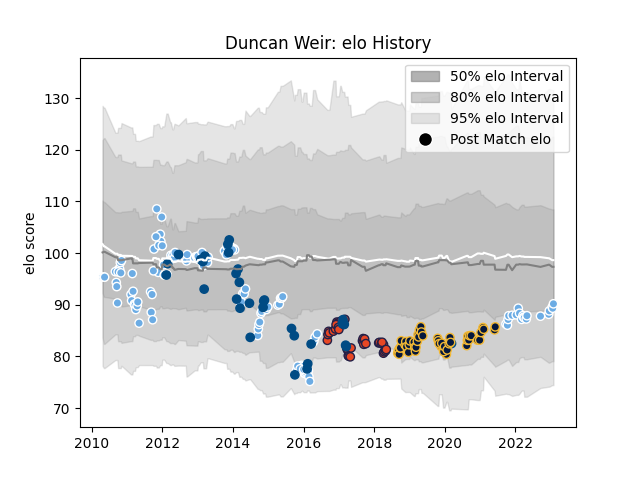

---  
layout: page  
title: Duncan Weir  
date: 2022-12-14 11:30:07.281560  
categories: player  
---
# Duncan Weir

## Positions: FH

## Country: Scotland

## Current elo: 97.0

## Current Percentile: 51.0

# Elo History

# Match History

| Team               |   Appearances |   Win Rate |
|:-------------------|--------------:|-----------:|
| Glasgow Warriors   |           127 |   0.586614 |
| Worcester Warriors |            50 |   0.32     |
| Edinburgh          |            35 |   0.485714 |
| Scotland           |            27 |   0.37037  |

| Opponent                 |   Matches |   Win Rate |
|:-------------------------|----------:|-----------:|
| Scarlets                 |        15 |   0.533333 |
| Dragons                  |        13 |   0.730769 |
| Ulster                   |        13 |   0.461538 |
| Munster                  |        13 |   0.461538 |
| Ospreys                  |        13 |   0.576923 |
| Cardiff Blues            |        13 |   0.538462 |
| Leinster                 |        12 |   0.25     |
| Benetton Treviso         |        11 |   0.454545 |
| Connacht                 |        11 |   0.590909 |
| Edinburgh                |         9 |   0.833333 |
| Bath Rugby               |         8 |   0.5      |
| Zebre                    |         7 |   1        |
| Leicester Tigers         |         6 |   0.5      |
| Exeter Chiefs            |         6 |   0.333333 |
| Wales                    |         5 |   0.2      |
| France                   |         5 |   0.2      |
| Northampton Saints       |         5 |   0        |
| Harlequins               |         5 |   0.6      |
| Wasps                    |         5 |   0        |
| Sale Sharks              |         4 |   0.5      |
| Aironi                   |         4 |   1        |
| Bristol Rugby            |         4 |   0.5      |
| Gloucester Rugby         |         4 |   0.25     |
| Italy                    |         4 |   1        |
| England                  |         4 |   0        |
| Ireland                  |         4 |   0.5      |
| Castres Olympique        |         3 |   0        |
| Glasgow Warriors         |         3 |   0.666667 |
| Saracens                 |         3 |   0.666667 |
| Newcastle Falcons        |         3 |   0        |
| Montpellier Herault      |         3 |   0.833333 |
| Toulon                   |         2 |   0        |
| Racing 92                |         2 |   0.5      |
| London Irish             |         2 |   1        |
| South Africa             |         2 |   0        |
| Stade Francais Paris     |         2 |   0.5      |
| Stade Toulousain         |         2 |   0        |
| Australia                |         1 |   0        |
| United States of America |         1 |   1        |
| Bulls                    |         1 |   0        |
| La Rochelle              |         1 |   0        |
| Timisoara Saracens       |         1 |   1        |
| Stormers                 |         1 |   0        |
| Pau                      |         1 |   1        |
| Argentina                |         1 |   1        |
| Lions                    |         1 |   1        |