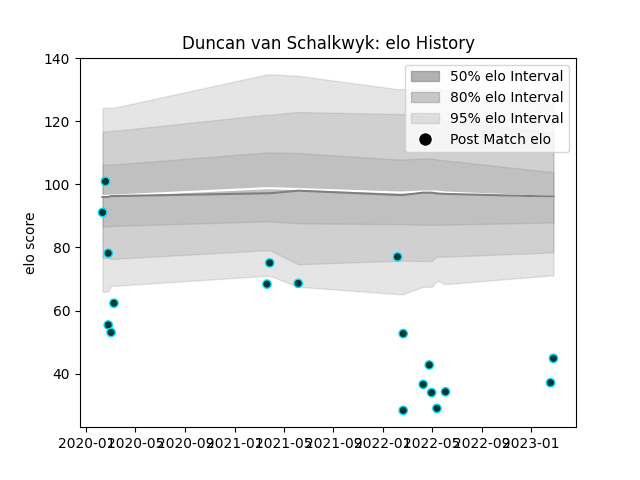

---  
layout: page  
title: Duncan van Schalkwyk  
date: 2023-02-26 11:19:00.783753  
categories: player  
---
# Duncan van Schalkwyk

## Positions: FH, SH

## Current elo: 45.0

## Current Percentile: 0.0

# Elo History

# Match History

| Team      |   Appearances |   Win Rate |
|:----------|--------------:|-----------:|
| Rugby ATL |            19 |   0.473684 |

| Opponent               |   Matches |   Win Rate |
|:-----------------------|----------:|-----------:|
| NOLA Gold              |         4 |   1        |
| Old Glory DC           |         3 |   0.333333 |
| Toronto Arrows         |         3 |   0.666667 |
| R.U. New York          |         2 |   0        |
| Rugby New York         |         2 |   0        |
| L. A. Giltinis         |         1 |   0        |
| New England Free Jacks |         1 |   0        |
| San Diego Legion       |         1 |   1        |
| Seattle Seawolves      |         1 |   0        |
| Utah Warriors          |         1 |   1        |