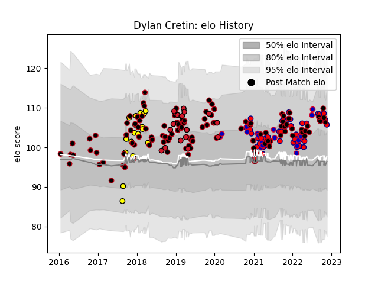

---  
layout: page  
title: Dylan Cretin  
date: 2022-11-22 11:35:43.333379  
categories: player  
---
# Dylan Cretin

## Positions: FL, N8

## Country: France

## Current elo: 106.0

## Current Percentile: 81.0

# Elo History

# Match History

| Team        |   Appearances |   Win Rate |
|:------------|--------------:|-----------:|
| Lyon        |           113 |   0.517699 |
| Aurillac    |            51 |   0.539216 |
| Carcassonne |            18 |   0.444444 |
| France      |            18 |   0.722222 |
| Oyonnax     |            17 |   0.617647 |

| Opponent                   |   Matches |   Win Rate |
|:---------------------------|----------:|-----------:|
| La Rochelle                |        10 |   0.3      |
| Montpellier Herault        |         9 |   0.777778 |
| Castres Olympique          |         8 |   0.375    |
| Toulon                     |         8 |   0.4375   |
| Racing 92                  |         8 |   0.5      |
| Montauban                  |         8 |   0.5625   |
| Stade Toulousain           |         7 |   0.428571 |
| Mont-de-Marsan             |         7 |   0.142857 |
| Grenoble                   |         7 |   0.428571 |
| Clermont Auvergne          |         7 |   0.428571 |
| Agen                       |         7 |   0.714286 |
| Carcassonne                |         7 |   0.571429 |
| Brive                      |         7 |   0.714286 |
| Biarritz Olympique         |         6 |   0.666667 |
| Bayonne                    |         6 |   0.666667 |
| Stade Francais Paris       |         6 |   0.666667 |
| Perpignan                  |         6 |   0.583333 |
| Pau                        |         5 |   0.6      |
| Narbonne                   |         5 |   0.6      |
| Provence Rugby             |         5 |   0.6      |
| Beziers                    |         5 |   0.8      |
| Bordeaux Begles            |         5 |   0.2      |
| Massy                      |         5 |   0.6      |
| Oyonnax                    |         5 |   0.6      |
| Rouen                      |         4 |   0.75     |
| Nevers                     |         4 |   1        |
| Soyaux-Angouleme           |         4 |   0.5      |
| Vannes                     |         4 |   0.25     |
| Wales                      |         4 |   1        |
| Scotland                   |         3 |   0.333333 |
| Cardiff Blues              |         3 |   0        |
| Ireland                    |         3 |   1        |
| Aurillac                   |         3 |   0.666667 |
| Colomiers                  |         3 |   1        |
| Newcastle Falcons          |         2 |   0.5      |
| US Bressane                |         2 |   0.5      |
| Australia                  |         2 |   0        |
| Dax                        |         2 |   1        |
| England                    |         2 |   0.5      |
| Ospreys                    |         2 |   0        |
| Italy                      |         2 |   1        |
| Saracens                   |         2 |   0        |
| Japan                      |         2 |   1        |
| Tarbes                     |         1 |   0        |
| Sale Sharks                |         1 |   0        |
| Valence Romans Drome Rugby |         1 |   0        |
| Benetton Treviso           |         1 |   1        |
| Northampton Saints         |         1 |   0        |