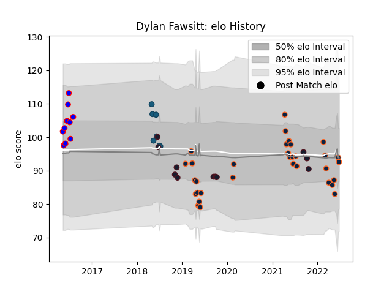

---  
layout: page  
title: Dylan Fawsitt  
date: 2023-03-02 11:24:17.349657  
categories: player  
---
# Dylan Fawsitt

## Positions: H

## Country: United States of America

## Current elo: 93.0

## Current Percentile: 50.0

# Elo History

# Match History

| Team                     |   Appearances |   Win Rate |
|:-------------------------|--------------:|-----------:|
| R.U. New York            |            40 |   0.65     |
| Rugby New York           |            33 |   0.69697  |
| United States of America |            12 |   0.416667 |
| Ohio                     |            10 |   0.8      |
| Glendale Raptors         |             7 |   0.857143 |

| Opponent               |   Matches |   Win Rate |
|:-----------------------|----------:|-----------:|
| Rugby ATL              |         9 |   0.666667 |
| San Diego Legion       |         9 |   0.555556 |
| NOLA Gold              |         9 |   0.666667 |
| New England Free Jacks |         8 |   0.5      |
| Seattle Seawolves      |         8 |   0.625    |
| Houston SaberCats      |         8 |   1        |
| Utah Warriors          |         7 |   0.714286 |
| Toronto Arrows         |         6 |   0.5      |
| Old Glory DC           |         5 |   1        |
| L. A. Giltinis         |         3 |   0.666667 |
| Sacramento             |         3 |   1        |
| San Diego              |         3 |   0.666667 |
| Glendale Raptors       |         3 |   0.666667 |
| Canada                 |         3 |   1        |
| Denver                 |         2 |   1        |
| Austin Elite Rugby     |         2 |   1        |
| San Francisco          |         2 |   0.5      |
| Austin Herd            |         2 |   1        |
| Uruguay                |         1 |   0        |
| Scotland               |         1 |   1        |
| Argentina              |         1 |   0        |
| Romania                |         1 |   1        |
| New Zealand Maori      |         1 |   0        |
| Ireland                |         1 |   0        |
| France                 |         1 |   0        |
| England                |         1 |   0        |
| Austin Gilgronis       |         1 |   0        |
| New Zealand            |         1 |   0        |