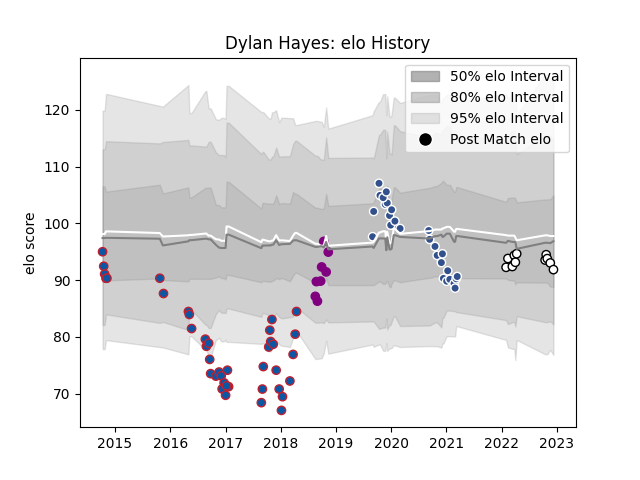

---  
layout: page  
title: Dylan Hayes  
date: 2022-12-18 16:32:11.012926  
categories: player  
---
# Dylan Hayes

## Positions: N8, FL

## Current elo: 92.0

## Current Percentile: 38.0

# Elo History

# Match History

| Team                       |   Appearances |   Win Rate |
|:---------------------------|--------------:|-----------:|
| Grenoble                   |            40 |   0.425    |
| Agen                       |            28 |   0.125    |
| Valence Romans Drome Rugby |            11 |   0.681818 |
| Soyaux-Angouleme           |             8 |   0.625    |

| Opponent             |   Matches |   Win Rate |
|:---------------------|----------:|-----------:|
| Brive                |         6 |   0.5      |
| La Rochelle          |         4 |   0        |
| Bayonne              |         4 |   0.5      |
| Stade Toulousain     |         4 |   0.25     |
| Bordeaux Begles      |         4 |   0        |
| Montpellier Herault  |         4 |   0        |
| Castres Olympique    |         4 |   0.25     |
| Clermont Auvergne    |         3 |   0        |
| Pau                  |         3 |   0        |
| Lyon                 |         3 |   0.333333 |
| Stade Francais Paris |         3 |   0.333333 |
| Massy                |         3 |   0.666667 |
| Carcassonne          |         3 |   0.666667 |
| Chambery             |         2 |   0.5      |
| Dax                  |         2 |   0.5      |
| Racing 92            |         2 |   0.25     |
| Vannes               |         2 |   1        |
| Biarritz Olympique   |         2 |   1        |
| Nice                 |         2 |   1        |
| Nevers               |         2 |   0.5      |
| Bourgoin-Jallieu     |         2 |   0.75     |
| Montauban            |         2 |   0.5      |
| Mont-de-Marsan       |         2 |   1        |
| Aurillac             |         2 |   0.5      |
| London Irish         |         2 |   0        |
| Toulon               |         2 |   0        |
| Edinburgh            |         2 |   0        |
| Soyaux-Angouleme     |         2 |   1        |
| Tarbes               |         1 |   1        |
| Suresnes             |         1 |   1        |
| Albi                 |         1 |   0        |
| Perpignan            |         1 |   0        |
| Ospreys              |         1 |   0        |
| Newcastle Falcons    |         1 |   1        |
| Cardiff Blues        |         1 |   0        |
| Beziers              |         1 |   0        |
| Wasps                |         1 |   0        |