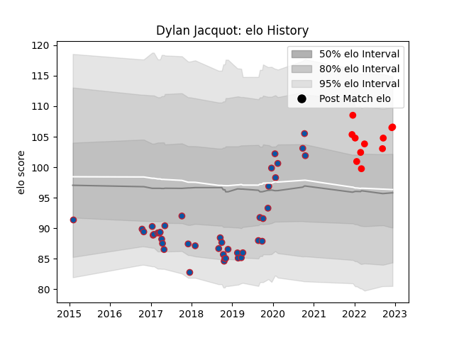

---  
layout: page  
title: Dylan Jacquot  
date: 2023-03-27 11:33:33.103246  
categories: player  
---
# Dylan Jacquot

Last updated: 2023-03-27
## Positions: P

## Current elo: 110.0

## Current Percentile: 84.0

# Elo History

# Match History

| Team     |   Appearances |   Win Rate |
|:---------|--------------:|-----------:|
| Grenoble |            65 |   0.507692 |
| Rouen    |            19 |   0.315789 |

| Opponent                   |   Matches |   Win Rate |
|:---------------------------|----------:|-----------:|
| Montauban                  |         7 |   0.357143 |
| Perpignan                  |         6 |   0.166667 |
| Beziers                    |         6 |   0.5      |
| Colomiers                  |         4 |   0.25     |
| Nevers                     |         4 |   0.5      |
| Aurillac                   |         4 |   0.75     |
| Lyon                       |         4 |   0.25     |
| Vannes                     |         4 |   1        |
| Bayonne                    |         4 |   0.5      |
| Carcassonne                |         3 |   0.333333 |
| Soyaux-Angouleme           |         3 |   1        |
| Castres Olympique          |         2 |   0.5      |
| Toulon                     |         2 |   0.25     |
| Stade Francais Paris       |         2 |   1        |
| Racing 92                  |         2 |   0.5      |
| Provence Rugby             |         2 |   0.5      |
| Oyonnax                    |         2 |   0.5      |
| Agen                       |         2 |   0.75     |
| Biarritz Olympique         |         2 |   0        |
| Mont-de-Marsan             |         2 |   0.5      |
| La Rochelle                |         2 |   0        |
| Clermont Auvergne          |         2 |   0.25     |
| Montpellier Herault        |         1 |   0        |
| Grenoble                   |         1 |   0        |
| Valence Romans Drome Rugby |         1 |   1        |
| US Bressane                |         1 |   0        |
| Stade Toulousain           |         1 |   0        |
| Brive                      |         1 |   0        |
| Rouen                      |         1 |   1        |
| Roval Drome XV             |         1 |   1        |
| Narbonne                   |         1 |   1        |
| Harlequins                 |         1 |   1        |
| Bordeaux Begles            |         1 |   0        |
| Benetton Treviso           |         1 |   0        |
| Newcastle Falcons          |         1 |   1        |