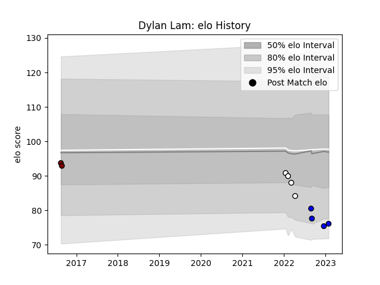

---  
layout: page  
title: Dylan Lam  
date: 2022-12-18 16:30:50.911248  
categories: player  
---
# Dylan Lam

## Positions: N8

## Current elo: 82.0

## Current Percentile: 11.0

# Elo History

# Match History

| Team          |   Appearances |   Win Rate |
|:--------------|--------------:|-----------:|
| Brive         |             4 |       0.25 |
| Massy         |             3 |       0    |
| North Harbour |             1 |       0    |

| Opponent    |   Matches |   Win Rate |
|:------------|----------:|-----------:|
| Grenoble    |         1 |          0 |
| La Rochelle |         1 |          0 |
| Oyonnax     |         1 |          0 |
| Pau         |         1 |          1 |
| Racing 92   |         1 |          0 |
| Rouen       |         1 |          0 |
| Saracens    |         1 |          0 |
| Waikato     |         1 |          0 |