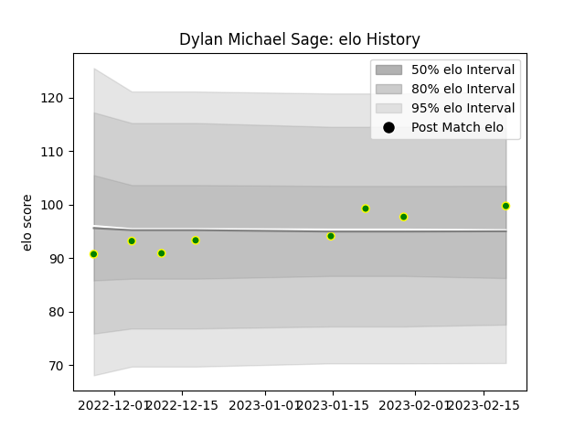

---  
layout: page  
title: Dylan Michael Sage  
date: 2023-03-17 17:34:17.423346  
categories: player  
---
# Dylan Michael Sage

## Positions: C, W

## Current elo: 94.0

## Current Percentile: 44.0

# Elo History

# Match History

| Team                |   Appearances |   Win Rate |
|:--------------------|--------------:|-----------:|
| Carqueiranne-Hyères |             7 |   0.428571 |

| Opponent                   |   Matches |   Win Rate |
|:---------------------------|----------:|-----------:|
| Albi                       |         1 |          0 |
| Bourgoin-Jallieu           |         1 |          0 |
| Chambery                   |         1 |          0 |
| Cognac Saint Jean d'Angély |         1 |          1 |
| Suresnes                   |         1 |          1 |
| US Bressane                |         1 |          1 |
| Valence Romans Drome Rugby |         1 |          0 |