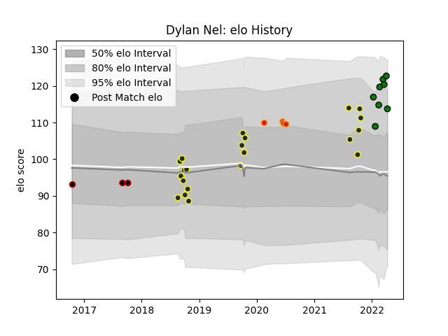

---  
layout: page  
title: Dylan Nel  
date: 2023-02-24 02:22:43.406326  
categories: player  
---
# Dylan Nel

## Positions: N8

## Current elo: 114.0

## Current Percentile: 93.0

# Elo History

# Match History

| Team                 |   Appearances |   Win Rate |
|:---------------------|--------------:|-----------:|
| Otago                |            21 |   0.571429 |
| Mitsubishi Dynaboars |             8 |   0.875    |
| Chiefs               |             4 |   0.25     |
| Canterbury           |             3 |   0.333333 |

| Opponent                 |   Matches |   Win Rate |
|:-------------------------|----------:|-----------:|
| Hawke's Bay              |         4 |   0.5      |
| Northland                |         3 |   0.666667 |
| Waikato                  |         3 |   0.666667 |
| Canterbury               |         3 |   0.333333 |
| Manawatu                 |         2 |   0.5      |
| Taranaki                 |         2 |   0        |
| Hanazono Kintetsu Liners |         2 |   1        |
| Hino Red Dolphins        |         2 |   1        |
| Southland                |         2 |   1        |
| Skyactivs Hiroshima      |         2 |   1        |
| Mie Honda Heat           |         2 |   0.5      |
| Sunwolves                |         1 |   1        |
| Auckland                 |         1 |   1        |
| North Harbour            |         1 |   1        |
| Bay of Plenty            |         1 |   1        |
| Hurricanes               |         1 |   0        |
| Highlanders              |         1 |   0        |
| Counties Manukau         |         1 |   0        |
| Blues                    |         1 |   0        |
| Wellington               |         1 |   0        |