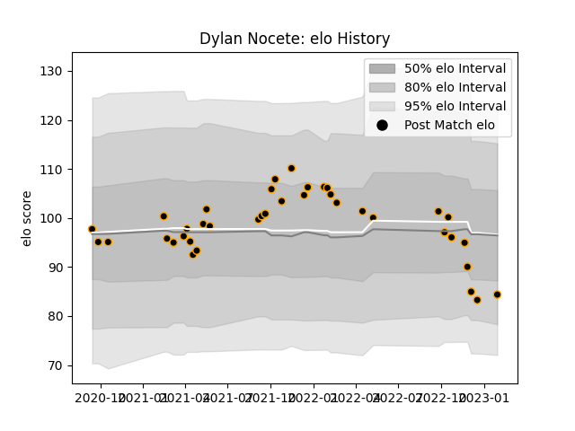

---  
layout: page  
title: Dylan Nocete  
date: 2022-12-14 11:31:53.170134  
categories: player  
---
# Dylan Nocete

## Positions: SH, FH

## Current elo: 87.0

## Current Percentile: 24.0

# Elo History

# Match History

| Team     |   Appearances |   Win Rate |
|:---------|--------------:|-----------:|
| Chambery |            21 |   0.333333 |

| Opponent                   |   Matches |   Win Rate |
|:---------------------------|----------:|-----------:|
| Blagnac                    |         4 |       0.25 |
| Aubenas                    |         2 |       0.5  |
| Bourgoin-Jallieu           |         2 |       0    |
| Nice                       |         2 |       0    |
| Tarbes                     |         2 |       1    |
| Albi                       |         1 |       0    |
| Carqueiranne-Hyères        |         1 |       0    |
| Cognac Saint Jean d'Angély |         1 |       1    |
| Massy                      |         1 |       0    |
| Rennes                     |         1 |       1    |
| Soyaux-Angouleme           |         1 |       1    |
| Suresnes                   |         1 |       0    |
| US Bressane                |         1 |       0    |
| Valence Romans Drome Rugby |         1 |       0    |