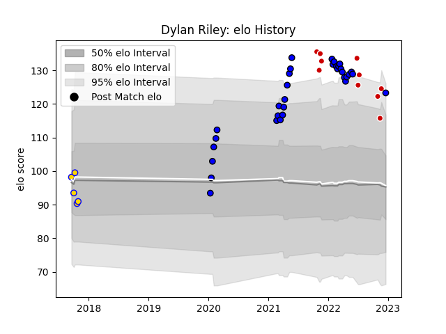

---  
layout: page  
title: Dylan Riley  
date: 2022-11-16 11:38:06.205157  
categories: player  
---
# Dylan Riley

## Positions: C

## Country: Japan

## Current elo: 112.0

## Current Percentile: 92.0

# Elo History

# Match History

| Team                 |   Appearances |   Win Rate |
|:---------------------|--------------:|-----------:|
| Saitama Wild Knights |            26 |   0.980769 |
| Japan                |             8 |   0.25     |

| Opponent                          |   Matches |   Win Rate |
|:----------------------------------|----------:|-----------:|
| Yokohama Canon Eagles             |         4 |   1        |
| Kobelco Kobe Steelers             |         3 |   0.833333 |
| NTT Docomo Red Hurricanes Osaka   |         3 |   1        |
| France                            |         2 |   0        |
| Shizuoka Blue Revs                |         2 |   1        |
| Urayasu D-Rocks                   |         2 |   1        |
| Toyota Verblitz                   |         2 |   1        |
| Kubota Spears Funabashi Tokyo-Bay |         2 |   1        |
| Toshiba Brave Lupus Tokyo         |         2 |   1        |
| Black Rams Tokyo                  |         2 |   1        |
| Uruguay                           |         1 |   1        |
| Tokyo Sungoliath                  |         1 |   1        |
| New Zealand                       |         1 |   0        |
| Portugal                          |         1 |   1        |
| Green Rockets Tokatsu             |         1 |   1        |
| Mitsubishi Dynaboars              |         1 |   1        |
| England                           |         1 |   0        |
| Ireland                           |         1 |   0        |
| Hino Red Dolphins                 |         1 |   1        |
| Australia                         |         1 |   0        |