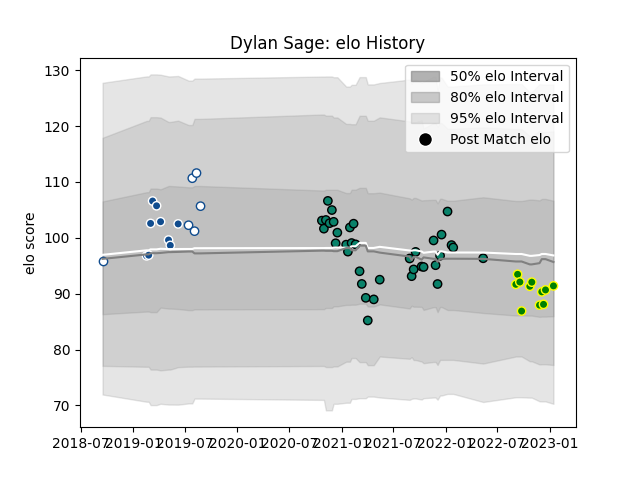

---  
layout: page  
title: Dylan Sage  
date: 2023-02-02 19:13:00.255953  
categories: player  
---
# Dylan Sage

## Positions: C, W

## Current elo: 88.0

## Current Percentile: 32.0

# Elo History

# Match History

| Team                |   Appearances |   Win Rate |
|:--------------------|--------------:|-----------:|
| Montauban           |            36 |   0.555556 |
| Carqueiranne-Hyères |            13 |   0.307692 |
| Bulls               |             9 |   0.5      |
| Blue Bulls          |             6 |   0.5      |

| Opponent                   |   Matches |   Win Rate |
|:---------------------------|----------:|-----------:|
| Carcassonne                |         4 |   0.25     |
| Nevers                     |         4 |   0.5      |
| Vannes                     |         3 |   0.333333 |
| Beziers                    |         3 |   0.333333 |
| Valence Romans Drome Rugby |         3 |   0.333333 |
| Albi                       |         2 |   0.5      |
| Jaguares                   |         2 |   0        |
| US Bressane                |         2 |   0.75     |
| Suresnes                   |         2 |   0.5      |
| Rouen                      |         2 |   0.5      |
| Pumas                      |         2 |   1        |
| Provence Rugby             |         2 |   0.5      |
| Perpignan                  |         2 |   0.5      |
| Oyonnax                    |         2 |   0.5      |
| Narbonne                   |         2 |   0.5      |
| Mont-de-Marsan             |         2 |   1        |
| Colomiers                  |         2 |   1        |
| Grenoble                   |         2 |   0.75     |
| Bourgoin-Jallieu           |         2 |   0        |
| Cognac Saint Jean d'Angély |         1 |   1        |
| Bayonne                    |         1 |   0        |
| Biarritz Olympique         |         1 |   0        |
| Chambery                   |         1 |   1        |
| Stormers                   |         1 |   1        |
| Soyaux-Angouleme           |         1 |   1        |
| Sharks                     |         1 |   1        |
| Chiefs                     |         1 |   0        |
| Highlanders                |         1 |   0.5      |
| Griquas                    |         1 |   0        |
| Crusaders                  |         1 |   0        |
| Dax                        |         1 |   0        |
| Nice                       |         1 |   0        |
| New South Wales Waratahs   |         1 |   1        |
| Golden Lions               |         1 |   1        |
| Natal Sharks               |         1 |   0        |
| Aurillac                   |         1 |   1        |
| Lions                      |         1 |   1        |
| Western Province           |         1 |   0        |