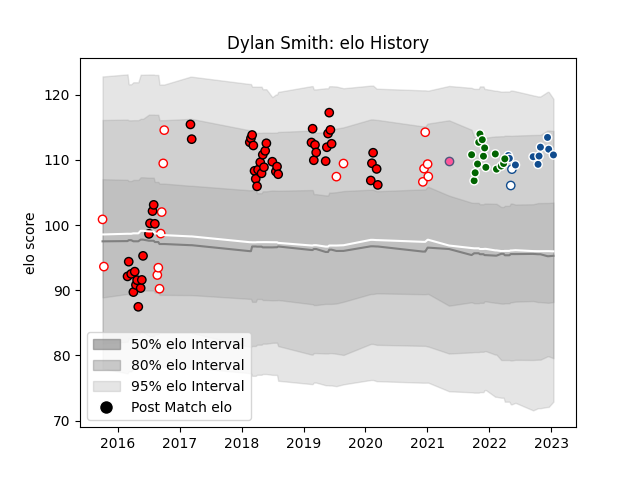

---  
layout: page  
title: Dylan Smith  
date: 2022-12-18 16:39:26.775888  
categories: player  
---
# Dylan Smith

## Positions: P

## Current elo: 94.0

## Current Percentile: 46.0

# Elo History

# Match History

| Team                 |   Appearances |   Win Rate |
|:---------------------|--------------:|-----------:|
| Lions                |            52 |   0.596154 |
| Golden Lions         |            12 |   0.666667 |
| Bulls                |             9 |   0.777778 |
| Ealing Trailfinders  |             6 |   0.666667 |
| Blue Bulls           |             2 |   1        |
| Stade Francais Paris |             1 |   1        |

| Opponent                 |   Matches |   Win Rate |
|:-------------------------|----------:|-----------:|
| Jaguares                 |         8 |   0.625    |
| Sharks                   |         7 |   0.714286 |
| Stormers                 |         6 |   0.666667 |
| Crusaders                |         4 |   0.25     |
| Hurricanes               |         4 |   0        |
| Bulls                    |         4 |   0.5      |
| New South Wales Waratahs |         4 |   1        |
| Blues                    |         3 |   0.333333 |
| Highlanders              |         3 |   0.666667 |
| Griquas                  |         3 |   0.666667 |
| Pumas                    |         2 |   1        |
| Melbourne Rebels         |         2 |   0.5      |
| Natal Sharks             |         2 |   1        |
| Western Province         |         2 |   1        |
| Queensland Reds          |         2 |   0.5      |
| Southern Kings           |         2 |   1        |
| Sunwolves                |         2 |   1        |
| Blue Bulls               |         2 |   0        |
| Benetton Treviso         |         2 |   1        |
| London Scottish          |         1 |   1        |
| Munster                  |         1 |   0        |
| Richmond                 |         1 |   1        |
| Lyon                     |         1 |   1        |
| Ampthill                 |         1 |   1        |
| Lions                    |         1 |   1        |
| Bedford                  |         1 |   0        |
| Golden Lions             |         1 |   1        |
| Glasgow Warriors         |         1 |   1        |
| Free State Cheetahs      |         1 |   0        |
| Exeter Chiefs            |         1 |   0        |
| Eastern Province Kings   |         1 |   1        |
| Cornish Pirates          |         1 |   0        |
| Chiefs                   |         1 |   1        |
| Cheetahs                 |         1 |   1        |
| Brumbies                 |         1 |   1        |
| Brive                    |         1 |   1        |
| Hartpury College         |         1 |   1        |