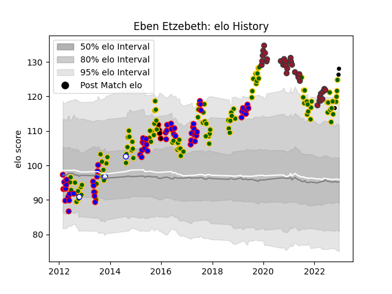

---  
layout: page  
title: Eben Etzebeth  
date: 2022-12-14 11:27:40.814094  
categories: player  
---
# Eben Etzebeth

## Positions: L

## Country: South Africa

## Current elo: 126.0

## Current Percentile: 97.0

# Elo History

# Match History

| Team                            |   Appearances |   Win Rate |
|:--------------------------------|--------------:|-----------:|
| South Africa                    |           110 |   0.622727 |
| Stormers                        |            62 |   0.66129  |
| Toulon                          |            35 |   0.585714 |
| NTT Docomo Red Hurricanes Osaka |             4 |   0.125    |
| Western Province                |             3 |   1        |
| Sharks                          |             2 |   1        |

| Opponent                 |   Matches |   Win Rate |
|:-------------------------|----------:|-----------:|
| New Zealand              |        19 |   0.236842 |
| Argentina                |        19 |   0.815789 |
| Australia                |        18 |   0.5      |
| Wales                    |        10 |   0.6      |
| England                  |        10 |   0.65     |
| Bulls                    |         8 |   0.875    |
| Ireland                  |         7 |   0.428571 |
| Sharks                   |         7 |   0.428571 |
| France                   |         6 |   0.833333 |
| Cheetahs                 |         6 |   1        |
| Lions                    |         5 |   0.5      |
| Italy                    |         5 |   1        |
| La Rochelle              |         4 |   0.25     |
| Scotland                 |         4 |   1        |
| Jaguares                 |         4 |   0.75     |
| Blues                    |         4 |   0.5      |
| Clermont Auvergne        |         3 |   0.666667 |
| Lyon                     |         3 |   0.333333 |
| Japan                    |         3 |   0.666667 |
| Bordeaux Begles          |         3 |   1        |
| British and Irish Lions  |         3 |   0.666667 |
| Melbourne Rebels         |         3 |   0.666667 |
| Highlanders              |         3 |   0.333333 |
| Montpellier Herault      |         3 |   0.333333 |
| Southern Kings           |         3 |   1        |
| Brive                    |         3 |   0.666667 |
| Brumbies                 |         3 |   0.666667 |
| New South Wales Waratahs |         3 |   0.666667 |
| Chiefs                   |         3 |   0.333333 |
| Crusaders                |         3 |   0.166667 |
| Queensland Reds          |         2 |   1        |
| Pau                      |         2 |   1        |
| Racing 92                |         2 |   0.5      |
| Stade Francais Paris     |         2 |   0.5      |
| London Irish             |         2 |   1        |
| Hurricanes               |         2 |   0.5      |
| Stade Toulousain         |         2 |   0.75     |
| Castres Olympique        |         2 |   0.5      |
| Western Force            |         2 |   1        |
| Samoa                    |         2 |   1        |
| Shizuoka Blue Revs       |         1 |   0        |
| Scarlets                 |         1 |   1        |
| Sunwolves                |         1 |   1        |
| Toyota Verblitz          |         1 |   0        |
| United States of America |         1 |   1        |
| Agen                     |         1 |   1        |
| Natal Sharks             |         1 |   1        |
| Namibia                  |         1 |   1        |
| Harlequins               |         1 |   1        |
| Green Rockets Tokatsu    |         1 |   0.5      |
| Glasgow Warriors         |         1 |   1        |
| Georgia                  |         1 |   1        |
| Free State Cheetahs      |         1 |   1        |
| Eastern Province Kings   |         1 |   1        |
| Canada                   |         1 |   1        |
| Bristol Rugby            |         1 |   0        |
| Bayonne                  |         1 |   0        |
| Yokohama Canon Eagles    |         1 |   0        |