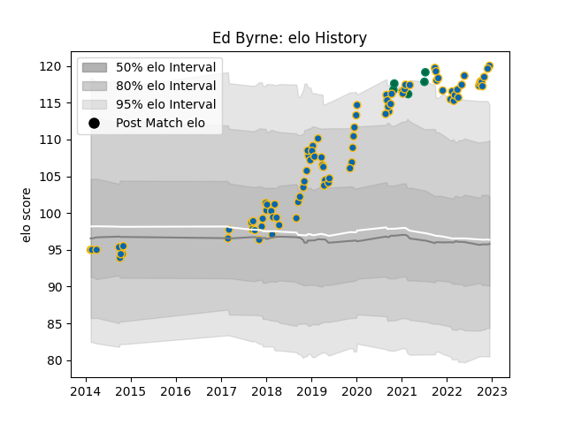

---  
layout: page  
title: Ed Byrne  
date: 2022-12-14 11:12:59.061008  
categories: player  
---
# Ed Byrne

## Positions: P

## Country: Ireland

## Current elo: 120.0

## Current Percentile: 97.0

# Elo History

# Match History

| Team     |   Appearances |   Win Rate |
|:---------|--------------:|-----------:|
| Leinster |            88 |   0.852273 |
| Ireland  |             5 |   0.6      |

| Opponent                 |   Matches |   Win Rate |
|:-------------------------|----------:|-----------:|
| Munster                  |        10 |   0.9      |
| Ulster                   |         9 |   0.888889 |
| Connacht                 |         8 |   0.875    |
| Benetton Treviso         |         7 |   0.785714 |
| Dragons                  |         7 |   1        |
| Scarlets                 |         6 |   0.916667 |
| Glasgow Warriors         |         6 |   0.666667 |
| Cardiff Blues            |         5 |   0.8      |
| Edinburgh                |         5 |   0.6      |
| Southern Kings           |         4 |   1        |
| Zebre                    |         4 |   1        |
| France                   |         2 |   0        |
| Northampton Saints       |         2 |   1        |
| Stade Toulousain         |         2 |   1        |
| Ospreys                  |         2 |   0.5      |
| Bath Rugby               |         2 |   1        |
| Italy                    |         1 |   1        |
| Racing 92                |         1 |   1        |
| Saracens                 |         1 |   0        |
| Lions                    |         1 |   1        |
| Sharks                   |         1 |   1        |
| Castres Olympique        |         1 |   1        |
| Lyon                     |         1 |   1        |
| Stormers                 |         1 |   0        |
| Bulls                    |         1 |   1        |
| United States of America |         1 |   1        |
| Wasps                    |         1 |   1        |
| Japan                    |         1 |   1        |