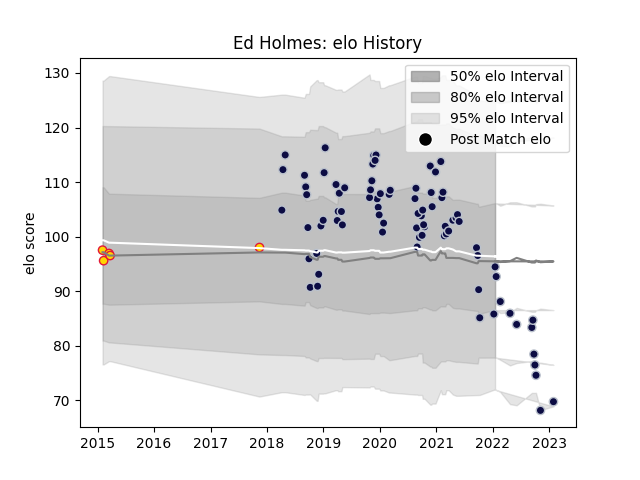

---  
layout: page  
title: Ed Holmes  
date: 2023-02-02 18:45:09.024649  
categories: player  
---
# Ed Holmes

## Positions: L

## Current elo: 94.0

## Current Percentile: 22.0

# Elo History

# Match History

| Team          |   Appearances |   Win Rate |
|:--------------|--------------:|-----------:|
| Bristol Rugby |            81 |   0.604938 |
| Exeter Chiefs |             5 |   0.6      |

| Opponent             |   Matches |   Win Rate |
|:---------------------|----------:|-----------:|
| Saracens             |         9 |   0.222222 |
| Bath Rugby           |         7 |   0.857143 |
| Wasps                |         7 |   0.142857 |
| Sale Sharks          |         7 |   0.357143 |
| Leicester Tigers     |         6 |   0.833333 |
| Worcester Warriors   |         6 |   0.5      |
| Gloucester Rugby     |         6 |   0.833333 |
| Exeter Chiefs        |         5 |   0.2      |
| Harlequins           |         5 |   0.6      |
| London Irish         |         4 |   0.75     |
| Newcastle Falcons    |         4 |   0.75     |
| Northampton Saints   |         3 |   0.666667 |
| Stade Francais Paris |         3 |   1        |
| La Rochelle          |         2 |   0.5      |
| Scarlets             |         2 |   1        |
| Zebre                |         2 |   0.75     |
| Bordeaux Begles      |         1 |   1        |
| Nottingham           |         1 |   1        |
| RC Enisei            |         1 |   1        |
| Hartpury College     |         1 |   1        |
| Dragons              |         1 |   1        |
| Toulon               |         1 |   1        |
| Doncaster            |         1 |   1        |
| Brive                |         1 |   1        |