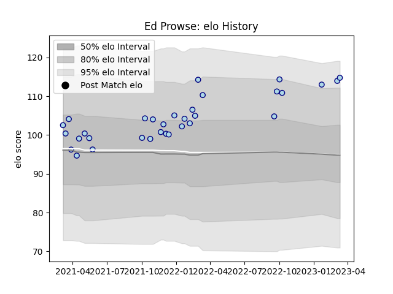

---  
layout: page  
title: Ed Prowse  
date: 2023-03-21 18:50:56.744740  
categories: player  
---
# Ed Prowse

Last updated: 2023-03-21
## Positions: P

## Current elo: 108.0

## Current Percentile: 90.0

# Elo History

# Match History

| Team    |   Appearances |   Win Rate |
|:--------|--------------:|-----------:|
| Bedford |            33 |   0.515152 |

| Opponent            |   Matches |   Win Rate |
|:--------------------|----------:|-----------:|
| Cornish Pirates     |         5 |   0.4      |
| Doncaster           |         5 |   0.4      |
| Richmond            |         4 |   0.5      |
| Coventry            |         3 |   0        |
| Hartpury College    |         3 |   1        |
| Nottingham          |         3 |   0.666667 |
| Ampthill            |         2 |   0.5      |
| Ealing Trailfinders |         2 |   0.5      |
| Jersey              |         2 |   0.5      |
| London Scottish     |         2 |   1        |
| Caldy               |         1 |   1        |
| Saracens            |         1 |   0        |