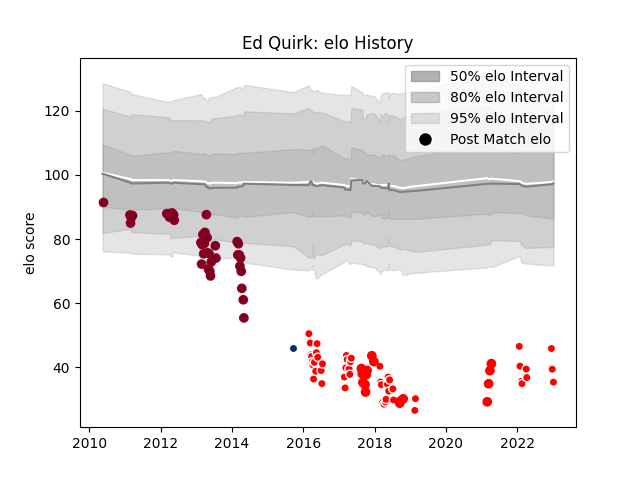

---  
layout: page  
title: Ed Quirk  
date: 2023-01-13 11:35:21.131729  
categories: player  
---
# Ed Quirk

## Positions: FL, N8

## Current elo: 35.0

## Current Percentile: 0.0

# Elo History

# Match History

| Team                  |   Appearances |   Win Rate |
|:----------------------|--------------:|-----------:|
| Queensland Reds       |            39 |  0.589744  |
| Sunwolves             |            39 |  0.0897436 |
| Yokohama Canon Eagles |            16 |  0.4375    |
| Chugoku Red Regulions |             9 |  0.222222  |
| Queensland Country    |             1 |  0         |

| Opponent                          |   Matches |   Win Rate |
|:----------------------------------|----------:|-----------:|
| Brumbies                          |         9 |   0.388889 |
| New South Wales Waratahs          |         8 |   0.25     |
| Western Force                     |         7 |   0.357143 |
| Stormers                          |         6 |   0.416667 |
| Melbourne Rebels                  |         6 |   0.5      |
| Cheetahs                          |         5 |   0.2      |
| Sharks                            |         5 |   0.2      |
| Bulls                             |         4 |   0.25     |
| Chiefs                            |         4 |   0.5      |
| Crusaders                         |         4 |   0        |
| Hurricanes                        |         4 |   0.25     |
| Blues                             |         3 |   0.666667 |
| Queensland Reds                   |         3 |   0.333333 |
| Munakata Sanix Blues              |         3 |   0.333333 |
| Black Rams Tokyo                  |         3 |   0.333333 |
| Lions                             |         3 |   0.333333 |
| Highlanders                       |         3 |   0.666667 |
| Toyota Industries Shuttles Aichi  |         2 |   0.5      |
| Southern Kings                    |         2 |   0        |
| Shizuoka Blue Revs                |         2 |   0.5      |
| Kurita Water Gush                 |         2 |   0.5      |
| Saitama Wild Knights              |         2 |   0        |
| Kyuden Voltex                     |         2 |   0        |
| Jaguares                          |         2 |   0.5      |
| Kobelco Kobe Steelers             |         2 |   0.5      |
| Perth Spirit                      |         1 |   0        |
| NTT Docomo Red Hurricanes Osaka   |         1 |   0        |
| Skyactivs Hiroshima               |         1 |   1        |
| Coca-Cola Red Sparks              |         1 |   1        |
| Tokyo Sungoliath                  |         1 |   0        |
| Kubota Spears Funabashi Tokyo-Bay |         1 |   0        |
| Toyota Verblitz                   |         1 |   0        |
| Green Rockets Tokatsu             |         1 |   1        |