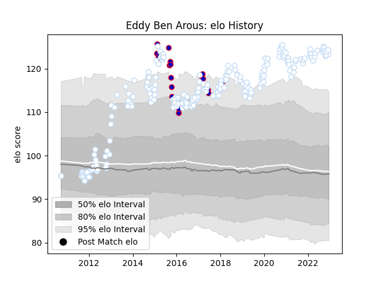

---  
layout: page  
title: Eddy Ben Arous  
date: 2022-12-18 16:24:52.155076  
categories: player  
---
# Eddy Ben Arous

## Positions: P

## Country: France

## Current elo: 123.0

## Current Percentile: 98.0

# Elo History

# Match History

| Team      |   Appearances |   Win Rate |
|:----------|--------------:|-----------:|
| Racing 92 |           221 |   0.631222 |
| France    |            19 |   0.578947 |

| Opponent             |   Matches |   Win Rate |
|:---------------------|----------:|-----------:|
| Toulon               |        18 |   0.611111 |
| Castres Olympique    |        15 |   0.6      |
| Clermont Auvergne    |        14 |   0.678571 |
| Stade Francais Paris |        13 |   0.538462 |
| Stade Toulousain     |        13 |   0.615385 |
| Brive                |        12 |   0.833333 |
| Montpellier Herault  |        11 |   0.772727 |
| La Rochelle          |        11 |   0.545455 |
| Bordeaux Begles      |        10 |   0.7      |
| Pau                  |         9 |   0.833333 |
| Lyon                 |         9 |   0.666667 |
| Munster              |         7 |   0.642857 |
| Grenoble             |         7 |   0.571429 |
| Saracens             |         7 |   0.285714 |
| Leicester Tigers     |         6 |   0.833333 |
| Oyonnax              |         6 |   0.5      |
| Perpignan            |         6 |   0.666667 |
| Bayonne              |         6 |   0.5      |
| Scarlets             |         5 |   0.9      |
| Agen                 |         5 |   0.6      |
| Northampton Saints   |         4 |   0.875    |
| Italy                |         4 |   1        |
| Ireland              |         4 |   0.25     |
| Ospreys              |         4 |   0.875    |
| Edinburgh            |         4 |   0.5      |
| Biarritz Olympique   |         4 |   0.75     |
| Scotland             |         3 |   0.666667 |
| Glasgow Warriors     |         3 |   0.333333 |
| South Africa         |         2 |   0        |
| Leinster             |         2 |   0        |
| Harlequins           |         2 |   0        |
| Cardiff Blues        |         2 |   0        |
| Benetton Treviso     |         2 |   1        |
| Wales                |         2 |   0.5      |
| New Zealand          |         1 |   0        |
| Mont-de-Marsan       |         1 |   1        |
| London Irish         |         1 |   0        |
| Romania              |         1 |   1        |
| Exeter Chiefs        |         1 |   0        |
| England              |         1 |   1        |
| Canada               |         1 |   1        |
| Bourgoin-Jallieu     |         1 |   1        |