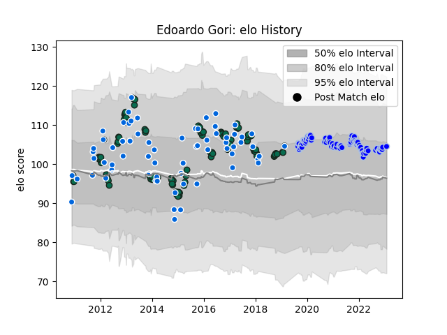

---  
layout: page  
title: Edoardo Gori  
date: 2022-11-22 11:27:38.660764  
categories: player  
---
# Edoardo Gori

## Positions: SH

## Country: Italy

## Current elo: 98.0

## Current Percentile: 62.0

# Elo History

# Match History

| Team             |   Appearances |   Win Rate |
|:-----------------|--------------:|-----------:|
| Benetton Treviso |           108 |   0.300926 |
| Italy            |            64 |   0.234375 |
| Colomiers        |            55 |   0.681818 |

| Opponent                   |   Matches |   Win Rate |
|:---------------------------|----------:|-----------:|
| Ospreys                    |        13 |  0.307692  |
| Munster                    |         9 |  0.111111  |
| Ireland                    |         9 |  0.111111  |
| Ulster                     |         9 |  0.0555556 |
| Zebre                      |         9 |  0.777778  |
| France                     |         8 |  0.125     |
| Scarlets                   |         8 |  0.25      |
| Scotland                   |         7 |  0.285714  |
| Connacht                   |         7 |  0.5       |
| England                    |         7 |  0         |
| Glasgow Warriors           |         7 |  0         |
| Wales                      |         6 |  0         |
| Leinster                   |         6 |  0         |
| Edinburgh                  |         6 |  0.5       |
| Australia                  |         5 |  0         |
| Beziers                    |         5 |  0.8       |
| Rouen                      |         5 |  1         |
| Nevers                     |         5 |  0.8       |
| Agen                       |         4 |  0.5       |
| Mont-de-Marsan             |         4 |  0.75      |
| Leicester Tigers           |         4 |  0         |
| Soyaux-Angouleme           |         4 |  0.5       |
| Montauban                  |         4 |  0.5       |
| Grenoble                   |         4 |  1         |
| Argentina                  |         4 |  0         |
| Dragons                    |         4 |  0.5       |
| Vannes                     |         4 |  0.5       |
| Cardiff Blues              |         4 |  0.375     |
| Carcassonne                |         4 |  0.75      |
| Biarritz Olympique         |         4 |  0.5       |
| United States of America   |         3 |  1         |
| Fiji                       |         3 |  1         |
| Aironi                     |         3 |  0.666667  |
| Aurillac                   |         3 |  0.333333  |
| Oyonnax                    |         3 |  0.5       |
| South Africa               |         3 |  0         |
| Toulon                     |         2 |  0         |
| Samoa                      |         2 |  0.5       |
| Bath Rugby                 |         2 |  0         |
| Northampton Saints         |         2 |  0         |
| Canada                     |         2 |  1         |
| Racing 92                  |         2 |  0         |
| Provence Rugby             |         2 |  1         |
| Bayonne                    |         2 |  0.5       |
| New Zealand                |         2 |  0         |
| US Bressane                |         1 |  1         |
| Cheetahs                   |         1 |  1         |
| Valence Romans Drome Rugby |         1 |  0         |
| Gloucester Rugby           |         1 |  0         |
| La Rochelle                |         1 |  0         |
| Roval Drome XV             |         1 |  1         |
| Russia                     |         1 |  1         |
| Stade Francais Paris       |         1 |  0         |
| Southern Kings             |         1 |  1         |
| Perpignan                  |         1 |  1         |
| Romania                    |         1 |  1         |
| Tonga                      |         1 |  0         |