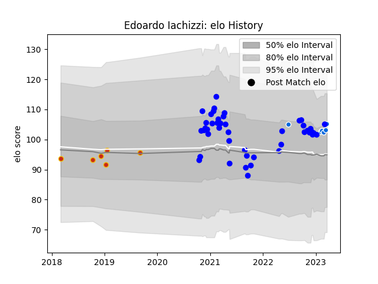

---  
layout: page  
title: Edoardo Iachizzi  
date: 2023-03-21 18:39:30.441500  
categories: player  
---
# Edoardo Iachizzi

Last updated: 2023-03-21
## Positions: FL, L

## Country: Italy

## Current elo: 105.0

## Current Percentile: 75.0

# Elo History

# Match History

| Team      |   Appearances |   Win Rate |
|:----------|--------------:|-----------:|
| Vannes    |            45 |   0.588889 |
| Italy     |             6 |   0.166667 |
| Perpignan |             6 |   0        |

| Opponent                   |   Matches |   Win Rate |
|:---------------------------|----------:|-----------:|
| Nevers                     |         5 |   0.5      |
| Montauban                  |         4 |   0.625    |
| Grenoble                   |         4 |   0.5      |
| Provence Rugby             |         4 |   0.75     |
| Rouen                      |         3 |   0.666667 |
| Oyonnax                    |         3 |   0.333333 |
| Mont-de-Marsan             |         3 |   0.333333 |
| Aurillac                   |         3 |   0.666667 |
| Colomiers                  |         3 |   1        |
| Perpignan                  |         2 |   0        |
| Soyaux-Angouleme           |         2 |   1        |
| Bayonne                    |         2 |   0        |
| Sale Sharks                |         2 |   0        |
| Beziers                    |         2 |   1        |
| Biarritz Olympique         |         2 |   0.5      |
| England                    |         1 |   0        |
| Valence Romans Drome Rugby |         1 |   0        |
| US Bressane                |         1 |   1        |
| Scotland                   |         1 |   0        |
| Bordeaux Begles            |         1 |   0        |
| France                     |         1 |   0        |
| Carcassonne                |         1 |   0.5      |
| Narbonne                   |         1 |   1        |
| Namibia                    |         1 |   1        |
| Massy                      |         1 |   0        |
| Ireland                    |         1 |   0        |
| Connacht                   |         1 |   0        |
| Wales                      |         1 |   0        |